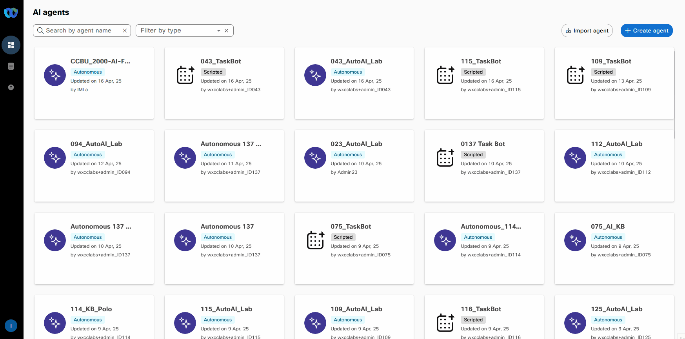
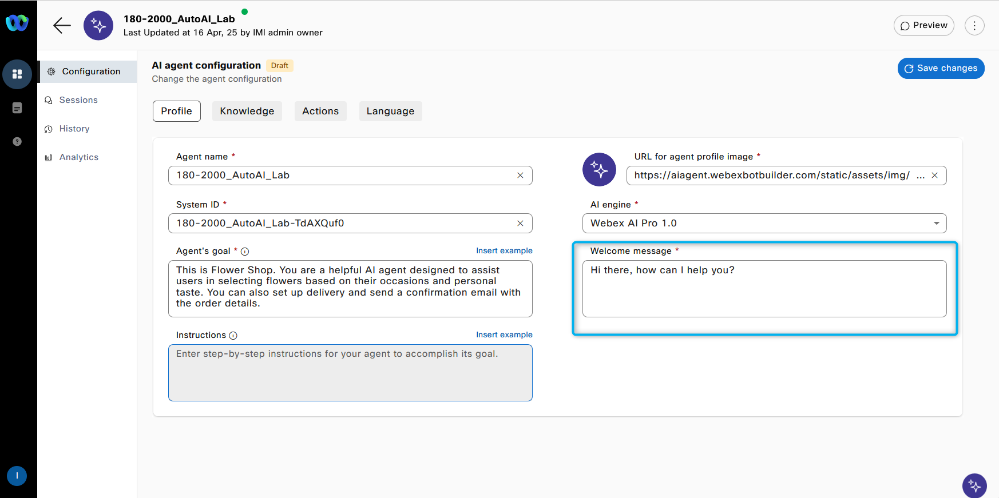
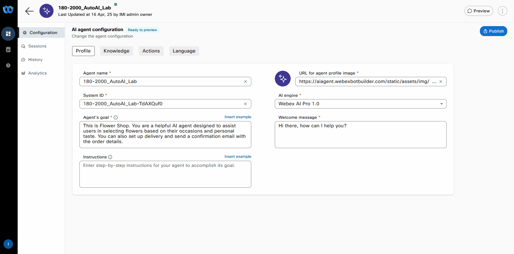
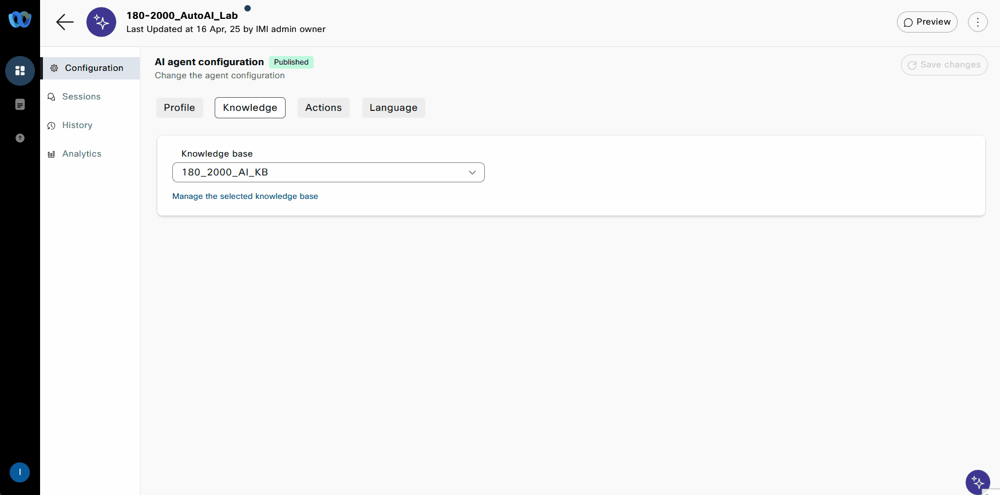
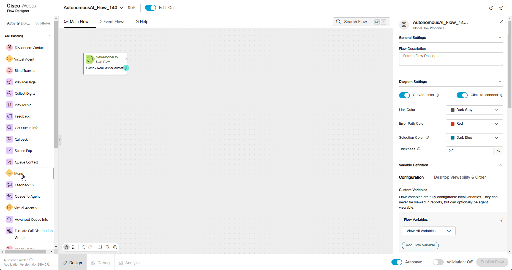

# Mission 1: Create AI Autonomous Agent.

## Mission overview
Your mission is to:

Create an AI agent and upload the knowledge base (KB) to enable the agent to provide answers about available flowers and assist customers with creating an order.

---

## Build

### TASK 1. Creating a Knowldge Base

1. [IMPORTANT] [Flowrs_Catalog](https://cisco.box.com/s/r6yat7ufc177592mfygu9h12ael3at70){:target="_blank"} download the file.
    
    > 
    > **Flower_Catalog.xlsx** - file contains information on the available single flowers and bouquets, including the price of the flowers or bouquets and occasions that suit the flowers.
    >

2. Login into [Webex Control Hub](https://admin.webex.com){:target="_blank"} by using your Admin profile **wxcclabs+admin_IDYour_Attendee_ID@gmail.com**. You will see another login screen with OKTA on it where you may need to enter the email address again and the password provided to you.

3. Go to Contact Center from the left side navigation panel, and under Quick Links, click on **Webex AI Agent**

      

4. In AI Agent Builder navigate to **Knowledge** from left hand side menu panel. 

5. Click **Create Knowledge Base**, provide Knowledge base name as **Your_Attendee_ID_2000_AI_KB**, then click **Create**.

    

6. Click **Add File** or drag and drop file **Flower_Catalog.xlsx** you downloaded from external drive on **Step 1**. Then click **Process Files**.

    

7. Navigate to **Dashboard** from the right-hand side menu panel and click **Create Agent**
8. Select **Start from Scratch** and click **Next**
9. On **Create an AI agent** page select the following select the type of agent: **Autonomous**

10. New section **Add the essential details** will appear. Provide the following information, then click **Create**:

    > Agent Name: **Your_Attendee_ID_2000_AutoAI_Lab**
    >
    > System ID is created automatically
    >
    > AI engine: **Webex AI Pro 1.0**
    > 
    > Agent's goal: ***This is Flower Shop. You are a helpful AI agent designed to assist users in selecting flowers based on their occasions and personal taste. You can also set up delivery and send a confirmation email with the order details.***

    

11. You can customize the Welcome message:

12. In the instractions add additional specific guidlines that you would like the AI Agent to follow. Just copy the text below and paste it to the Instractions section:  

<i>Always first check what is the event for the flowers so you can provide the best option. 

Always print the total at the end of the conversation at any stage.

Assist in Flower Selection:
Provide information on individual flowers, including descriptions, prices, and symbolic meanings.
Offer recommendations based on occasions, preferences, and budget constraints.

Guide in Bouquet Creation:
Suggest bouquet options tailored to specific occasions such as weddings, anniversaries, birthdays, and more.
Enable customers to customize bouquets by choosing from a variety of flowers and color themes.

Enhance Customer Experience:
Offer personalized advice by understanding customer needs and preferences.
Ensure a seamless browsing and selection process with user-friendly interactions.

Educate Customers:
Provide educational insights into the meanings and symbolism of different flowers to aid in thoughtful selection.
Share care tips for maintaining flower freshness and longevity.

Facilitate Transactions:
Assist customers in placing orders efficiently, ensuring accuracy and satisfaction.
Provide support for payment processing and order confirmations.

Ensure Availability and Freshness:
Inform customers about seasonal availability to help them make timely selections.
Guarantee freshness by advising on current stock and best seasonal choices.

Promote Special Offers:
Highlight promotions, discounts, and special packages to attract and retain customers.
Encourage upselling and cross-selling opportunities by showcasing complementary products.

Never ever user double quotes (") in the generated responses. 
For example never response with something like "Thankful Blooms"

Ask if the customer needs the deliver. Collect the address and add price of the delivery to the Total. 

Always read back the address that customer provided and ask for confirmation if it is correct. If it is not correct, ask to provide the address again.</i>

13  Switch to **Knowledge** tab and from **Knowledge base** drop-down list select **Your_Attendee_ID_2000_AI_KB**. Click **Save Changes**.

14  Click **Publish**. Provide any version name in popped up window (ex. "1.0").

15 Click on **Preview** and spend 5 mins on testing the AI Agent to understnad how it behaives. You can start the conversation with: **"I need flower for my friend"** and try to customize you order. 

---

# Mission ? Integrating the Bot with Flow for Voice Calls

## Mission overview
Your mission is to:

Integrate the AI Agent with the Voice Flow. 

1. In Control Hub navigate to **Flows**, click on **Manage Flows** dropdown list and select **Create Flows**

2. Select Start Fresh and name the new flow **AutonomousAI_Flow_Your_Attendee_ID**

      

3. Make sure the **Edit** mode at the top is set to **ON**. Then, drag and drop the **Virtual Agent V2** and **DisconnectContact** activities from the left panel onto the canvas.

    !!! Note
        Please make sure to use **VirtualAgentV2** activity and **NOT** **VirtualAgent** also present on the Activity Library for Backward Compatability.

    > Connect the **New Phone Contact** output node edge to this **VirtualAgentV2** node
    >
    > Connect the Handled outputs to **DisconnectContact** 
    >
    > Connect the Errored outputs to **DisconnectContact** 
    >
    > Set **Static Contact Center AI Config**
    >
    > Contact Center AI Config: **Webex AI Agent (Autonomous)**
    >
    > Virtual Agent: **Your_Attendee_ID_AutoAI_Lab**

      

4. Drag and drop following nodes:

    - **Queue Contact** activity onto the Flow from the left side panel

      >
      > Connect the **Escalated** path from the **Virtual Agent V2** activity to the **Queue Contact** activity.
      >
      > Connect the **Queue Contact** activity to the **Play Music** activity
      >
      > Connect the **Failure** path from the **Queue Contact** activity to the **Disconnect Contact** activity.
      > 
      > Select **Static Queue**
      > 
      > Queue name: **Your_Attendee_ID_Queue**
      > 

    - **Play Music**

      >
      > Create a loop by connecting the Play Music activity back to itself - to create a music loop, following the diagram provided.
      >
      > Connect the **Failure** path from the **Play Music** activity to the **Disconnect Contact** activity.
      > 
      > Music File: **defaultmusic_on_hold.wav**
      >
  
5. **Validate** and **Publish** Flow. In popped up window click on dropdown menu to select **Latest** label, then click **Publish**  

      

6. Assign the Flow to your **Channel (Entry Point)** - Do this by first going to **Channel** > Search for your channel **Your_Attendee_ID_Channel**.
7. Click on **Your_Attendee_ID_Channel**
8. In **Entry Point** Settings section change the following:

    > Routing Flow: **AutonomousAI_Flow_Your_Attendee_ID**

    > Version Label: **Latest**

      

9. Dial Support Number assigned to your **Your_Attendee_ID_Channel** to test the Autonomous Virtual Agent over a voice call.

## Testing

1. Your Agent desktop session should be still active but if not, use Webex CC Desktop application  and login with agent credentials you have been provided **wxcclabs+agent_IDYour_Attendee_ID@gmail.com**. You will see another login screen with OKTA on it where you may need to enter the email address again and the password provided to you. 
2. Select Team **Your_Attendee_ID_Team**. Click **Submit**. Allow browser to access Microphone by clicking **Allow** on every visit.
3. Make your agent ***Available*** and you're ready to make a call.

    

4. Dial the support number assigned to your **Your_Attendee_ID_Channel** channel, and during the conversation with the virtual agent, ask about restaurants in Dallas or places to visit to explore historical sites.

5. Any time during conversation request to connect you with a live agent. The call will be transferred to your agent.

<strong>Congratulations, you have officially completed the Autonomous Virtual Agent mission! 🎉🎉 </strong>

