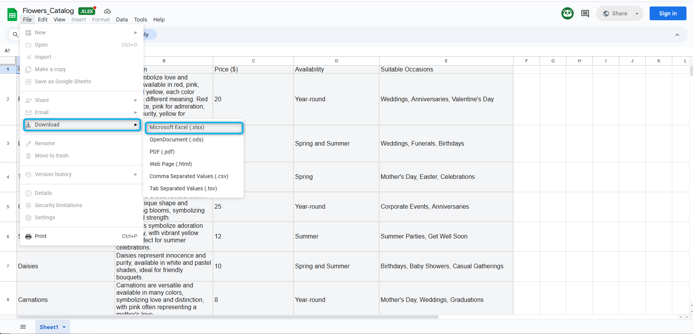
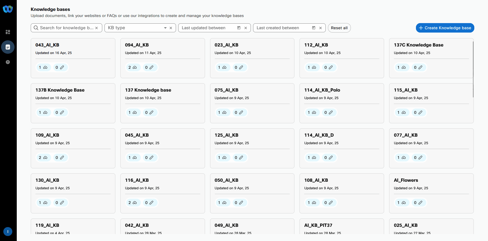
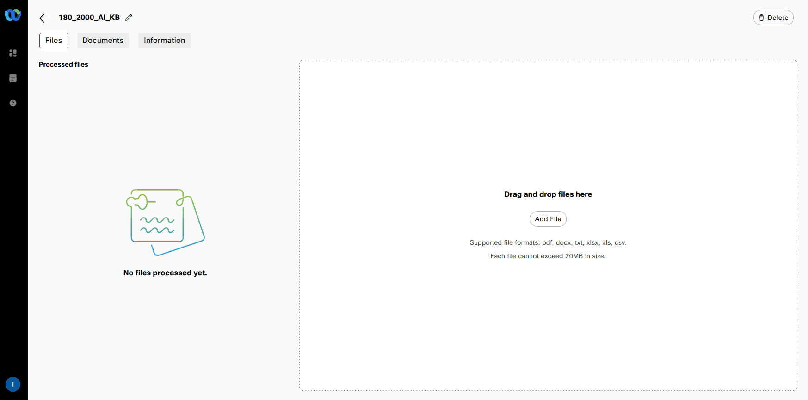
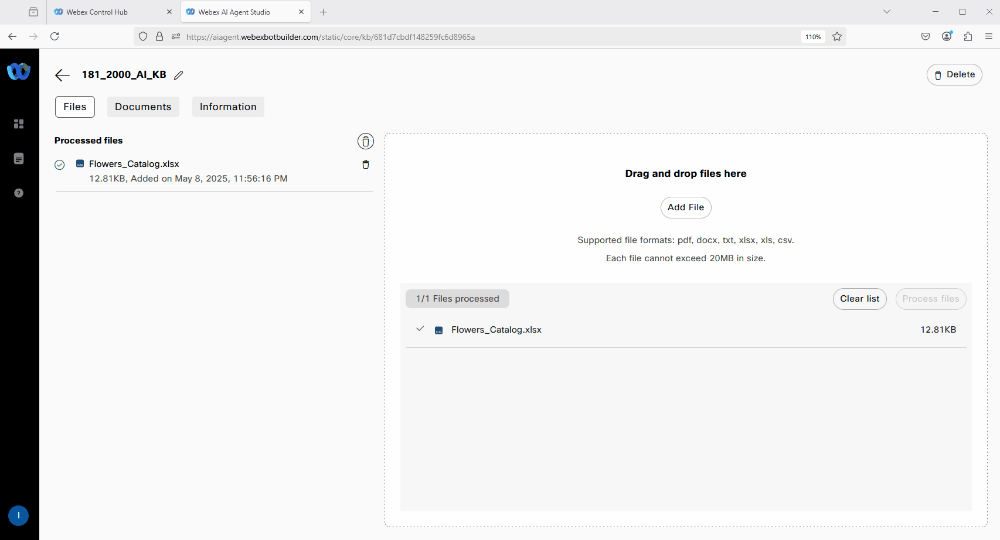
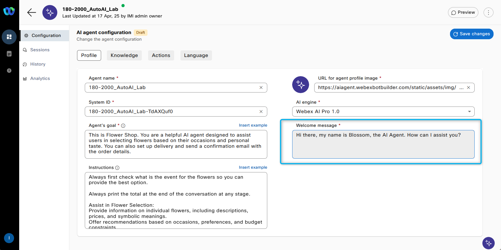
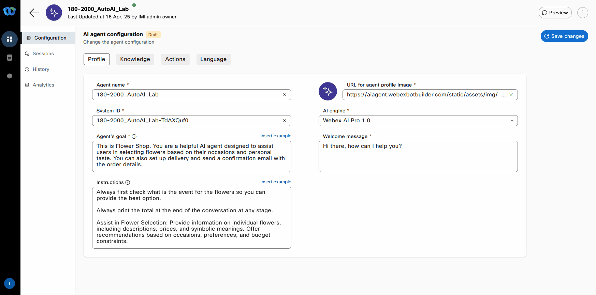

# Mission 1: Create AI Autonomous Agent.

## Mission overview
Your mission is to:

Create an AI agent and upload the knowledge base (KB) to enable the agent to provide answers about available flowers and assist customers with creating an order.

---

## Build

### Task 1. Creating new AI Agent with Knowladge Base.

1. [IMPORTANT] Download .xlsx the file [Flowrs_Catalog](https://docs.google.com/spreadsheets/d/1QjbL58okbEfl-ODgyv_ohIIPUiPBP34n/edit?usp=sharing&ouid=100862210011127627593&rtpof=true&sd=true){:target="_blank"}.
    
    
    > 
    > **Flower_Catalog.xlsx** - file contains information on the available single flowers and bouquets, including the price of the flowers or bouquets and occasions that suit the flowers.
    >

2. Open up and review the file. 
    

3. Login into [Webex Control Hub](https://admin.webex.com){:target="_blank"} by using your Admin profile **wxcclabs+admin_IDYour_Attendee_ID@gmail.com**. You will see another login screen with OKTA on it where you may need to enter the email address again and the password provided to you.

4. Go to Contact Center from the left side navigation panel, and under Quick Links, click on **Webex AI Agent**

      

5. In AI Agent Builder navigate to **Knowledge** from left hand side menu panel. 

6. Click **Create Knowledge Base**, provide Knowledge base name as **Your_Attendee_ID_2000_AI_KB**, then click **Create**.

    

7. Click **Add File** or drag and drop file **Flower_Catalog.xlsx** you downloaded from external drive on **Step 1**. Then click **Process Files**.

    

8. Navigate to **Dashboard** from the right-hand side menu panel and click **Create Agent**
    
9. Select **Start from Scratch** and click **Next**
10. On **Create an AI agent** page select the following select the type of agent: **Autonomous**

11. New section **Add the essential details** will appear. Provide the following information, then click **Create**:

    > Agent Name: **Your_Attendee_ID_2000_AutoAI_Lab**
    >
    > System ID is created automatically
    >
    > AI engine: **Webex AI Pro 1.0**
    > 
    > Agent's goal: ***This is Flower Shop. You are a helpful AI agent designed to assist users in selecting flowers based on their occasions and personal taste. You can also set up delivery and send a confirmation SMS with the order details.***

    

12. Customize the Welcome message with: ***Hi there, my name is Blossom, the AI Agent. How can I assist you?***

    

13. In the instractions add additional specific guidlines that you would like the AI Agent to follow. Just **copy the text below and paste it to the Instractions section**:  

    >Always first check what is the event for the flowers so you can provide the best option. 

    >Always print the total at the end of the conversation at any stage.

    >Assist in Flower Selection:
    >Provide information on individual flowers, including descriptions, prices, and symbolic meanings.
    >Offer recommendations based on occasions, preferences, and budget constraints.

    >Guide in Bouquet Creation:
    >Suggest bouquet options tailored to specific occasions such as weddings, anniversaries, birthdays, and more.
    >Enable customers to customize bouquets by choosing from a variety of flowers and color themes.

    >Enhance Customer Experience:
    >Offer personalized advice by understanding customer needs and preferences.
    >Ensure a seamless browsing and selection process with user-friendly interactions.

    >Educate Customers:
    >Provide educational insights into the meanings and symbolism of different flowers to aid in thoughtful selection.
    >Share care tips for maintaining flower freshness and longevity.

    >Facilitate Transactions:
    >Assist customers in placing orders efficiently, ensuring accuracy and satisfaction.
    >Provide support for payment processing and order confirmations.

    >Ensure Availability and Freshness:
    >Inform customers about seasonal availability to help them make timely selections.
    >Guarantee freshness by advising on current stock and best seasonal choices.

    >Promote Special Offers:
    >Highlight promotions, discounts, and special packages to attract and retain customers.
    >Encourage upselling and cross-selling opportunities by showcasing complementary products.

    >Ask if the customer needs the deliver. Collect the address and add price of the delivery to the Total. 

    >Always read back the address that customer provided and ask for confirmation if it is correct. If it is not correct, ask to provide the address again.

    >Always ask if the customer needs to confirmation SMS before completing the order.  
    

14.  Switch to **Knowledge** tab and from **Knowledge base** drop-down list select **Your_Attendee_ID_2000_AI_KB**. Click **Save Changes**.
    

15.  Click **Publish**. Provide any version name in popped up window (ex. "1.0"). 
    

### Task 2. Test your AI Agent

1. Click on **Preview** and testing the AI Agent to understnad how it behaives using Chat channel. You can start the conversation with: **"I need flower for my friend"** and try to customize you order. 

2. Click on **Preview** and testing the AI Agent to understnad how it behaives using Voice channel. You can start the conversation with: **"I need flower for my friend"** and try to customize you order. 

<strong>Congratulations, you have officially completed this mission! 🎉🎉 </strong>
