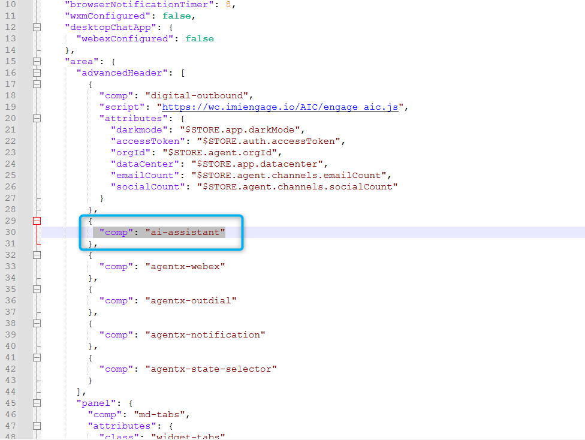

## Feature Description

Customers find it frustrating to repeat themselves, especially after a call drop. Now, agents can pick up where the call left off, reducing frustration and handling time, while empowering agents to work more efficiently.

The Cisco AI Assistant provides a summary of the recently dropped interaction, detailing the reason for the call and the last action discussed. This enables agents to seamlessly resume the conversation.

## Mission Details

Your mission is to:

Understand the provisioning process and Control Hub settings required to activate this AI feature. Review the agent configurations with the correct desktop layout. Test the feature.

## Build

### Task 1 [READ ONLY]. Order Provisioning & Control Hub Settings

1. You should purchase the new AI Assistant SKU **A-FLEX-AI-ASST** from CCW.

2. Once you purchas the offer, admins with the appropriate profile and access controls will be able to see the AI Assistant menu in Control Hub. Post purchasing the offer, the customer can enable/disable the **Virtual Agent Transfer Summary** features from the Control Hub.
   

3. The Agent needs to logged in to the Team that is configured with Desktop Layout that has AS 
     Agents Team:
       
     Desktop Layout:
    
     Desktop Layout file: Make sure **ai-assistant** is configured under the **advancedHeader**
   
     You can download preconfigured desktop layout here.
   [Desktop Layout](https://cisco.box.com/shared/static/o4nrnjengm6od7coql9etz3a3lwzvw1w.json){:target="_blank"} 

### Task 2. Test Call Drop Summary Feature