# Mission 2: Configure Action and create an order.

 **<details><summary>What is Action? <span style="color: orange;">[Optional]</span></summary>**
An action is a functionality that lets your AI agent connect with external systems so it can perform more
complex tasks, such as bookings or finding information. 

For more information visit [Webex Documentation](https://help.webex.com/en-us/article/ncs9r37/Webex-AI-Agent-Studio-Administration-guide#concept-template_5ea99e1f-a679-4cf9-8e33-7a4f83d9f66a){:target="_blank"}


</details>
---


## Mission overview
Your mission is to:

Configure an action to collect order details from the customer and send them to a third-party application via APIs.

---

## Build

### Task 1. Create Service and AI Agent Flow in Webex Connect. 

1. From Control Hub, go to Contact Center and open up Webex Connect Portal. 
    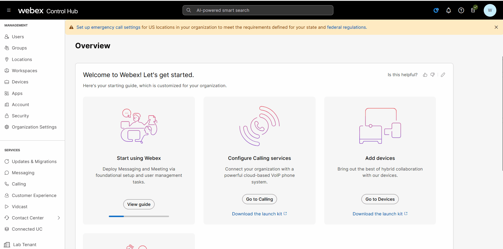


2. Create new Service with name **<span class="attendee-id-container"><span class="attendee-id-placeholder" data-suffix="_2000_Service">Your_Attendee_ID</span>_2000_Service<span   class="copy" title="Click to copy!"></span></span>**
    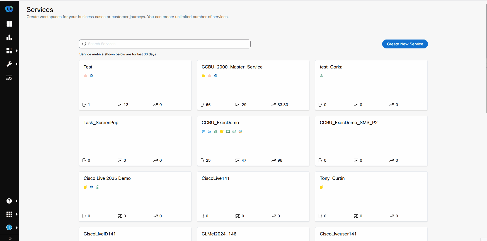


3. Click on Flows and create new flow with the name ***Create_Ordedr_Flowers***<span class="copy-static" title="Click to copy!" data-copy-text="Create_Ordedr_Flowers"><span class="copy"></span></span>.

    

4. From the Integrations list select AI Agent. 
    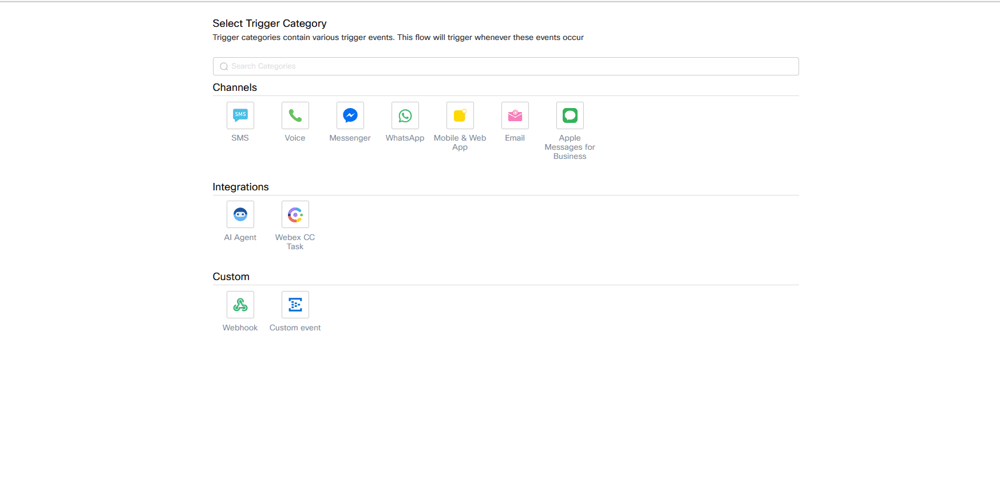

5. For now, save the flow and make it live. We will return to configuring this flow later. Creating it now is necessary to complete configurations in the AI Studio Portal.
    

### Task 2. Configure Action in the AI Studio.

1. Login to the AI Studio Portal. 
    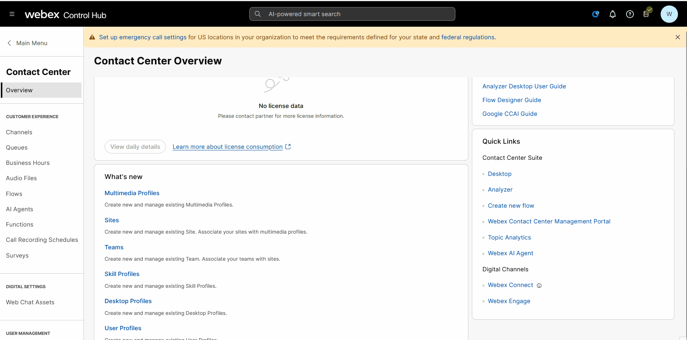

2. Select your AI agent with name **<span class="attendee-id-container"><span class="attendee-id-placeholder" data-suffix="_2000_AutoAI_Lab">Your_Attendee_ID</span>_2000_AutoAI_Lab<span   class="copy" title="Click to copy!"></span></span>** that we created earlier, go to Actions. You will see one action is already created by default for the Agent Handoff. We will be creating more actions.

    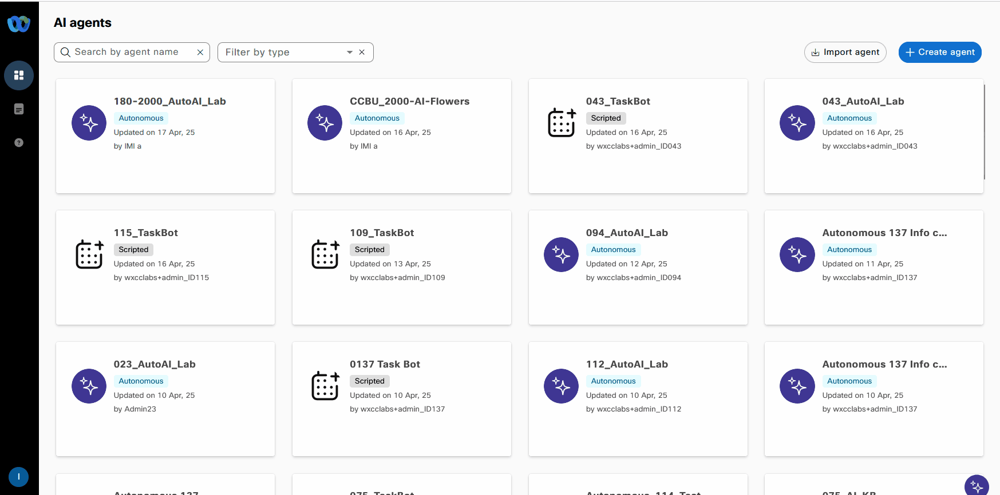

3. Click on creat <b>New Action</b>. Configure it with name ***Create_New_Order***<span class="copy-static" title="Click to copy!" data-copy-text="Create_New_Order"><span class="copy"></span></span> and the Action Description ***Collect order details, delivery address, total and response with the orderNumber once the order is completed.***<span class="copy-static" title="Click to copy!" data-copy-text="Collect order details, delivery address, total and response with the orderNumber once the order is completed."><span class="copy"></span></span>. In the Action score select <b>Slot filling and fulfillment</b>.
    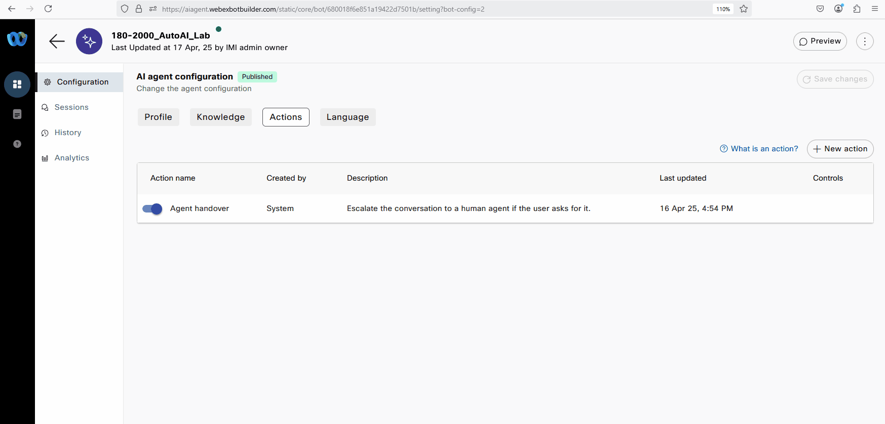

4. Scroll down and click to create "New input entity". Fill up the table with the following: <br>
Entity Name: ***address***<span class="copy-static" title="Click to copy!" data-copy-text="address"><span class="copy"></span></span> <br>
Entity Typs: <b>string</b> <br>
Description: ***Collect the customer's delivery address***<span class="copy-static" title="Click to copy!" data-copy-text="Collect the customer's delivery address"><span class="copy"></span></span> <br>
Example: ***548 Catalina Drvie, Cary, NC 27515***<span class="copy-static" title="Click to copy!" data-copy-text="548 Catalina Drvie, Cary, NC 27515"><span class="copy"></span></span> <br>
Required: <b>Yes</b>
    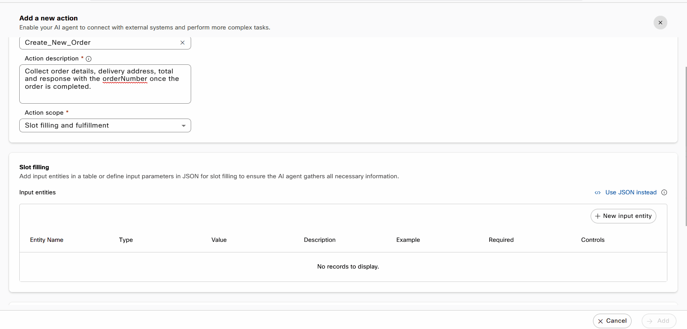

5. By following the same pattern, create an entity that specifies whether the customer requires delivery. <br>
Entity Name: ***delivery***<span class="copy-static" title="Click to copy!" data-copy-text="delivery"><span class="copy"></span></span> <br>
Entity Typs: <b>string</b> <br>
Description: ***Check if the customer needs delivery or not. Event if they want to proceed with order without specifying the delivery details. If the customer wants to confirm the order but didn't specify if they need delivery or not, ask one more time if they need the delivery or not.***<span class="copy-static" title="Click to copy!" data-copy-text="Check if the customer needs delivery or not. Event if they want to proceed with order without specifying the delivery details. If the customer wants to confirm the order but didn't specify if they need delivery or not, ask one more time if they need the delivery or not."><span class="copy"></span></span> <br>
Example: ***Yes,No***<span class="copy-static" title="Click to copy!" data-copy-text="Yes,No"><span class="copy"></span></span> <br>
Required: <b>Yes</b>

6. By following the same pattern, create an entity to collect the customer's email address.
Entity Name: ***email***<span class="copy-static" title="Click to copy!" data-copy-text="email"><span class="copy"></span></span> <br>
Entity Typs: <b>string</b> <br>
Description: ***Before the customer complete the order, ask if they would like to receive confirmation over the email. If so, collect the email address.***<span class="copy-static" title="Click to copy!" data-copy-text="Before the customer complete the order, ask if they would like to receive confirmation over the email. If so, collect the email address."><span class="copy"></span></span> <br>
Example: ***mdanylch@cisco.com, ktyagi@cisco.com***<span class="copy-static" title="Click to copy!" data-copy-text="mdanylch@cisco.com, ktyagi@cisco.com"><span class="copy"></span></span> <br>
Required: <b>Yes</b>

7. By following the same pattern, create an entity to collect the customer's order details.
Entity Name: ***orderDetails***<span class="copy-static" title="Click to copy!" data-copy-text="orderDetails"><span class="copy"></span></span> <br>
Entity Typs: <b>string</b> <br>
Description: ***Collect the flowers and bouquets information that customer orders. Make sure to do correct math. If one rose is 20 dollars and the customer would like buy 9 rouses then the price should be 180 dollars. Don't use double quotes (") in the generated responses.***<span class="copy-static" title="Click to copy!" data-copy-text="Collect the flowers and bouquets information that customer orders. Make sure to do correct math. If one rose is 20 dollars and the customer would like buy 9 rouses then the price should be 180 dollars. Don't use double quotes in the generated responses."><span class="copy"></span></span> <br>
Example: ***Romantic Roses standard bouquet and one more bouquet with 9 roses***<span class="copy-static" title="Click to copy!" data-copy-text="Romantic Roses standard bouquet and one more bouquet with 9 roses"><span class="copy"></span></span> <br>
Required: <b>Yes</b>

8. By following the same pattern, create an entity to store the total price information of the order.
Entity Name: ***orderTotal***<span class="copy-static" title="Click to copy!" data-copy-text="orderTotal"><span class="copy"></span></span> <br>
Entity Typs: <b>string</b> <br>
Description: ***After the customer inform if they need delivery or not, and confirm that they would like to proceed with completing the order, collect the Total information and assigned it to this slot.***<span class="copy-static" title="Click to copy!" data-copy-text="After the customer inform if they need delivery or not, and confirm that they would like to proceed with completing the order, collect the Total information and assigned it to this slot."><span class="copy"></span></span> <br>
Example: ***150 dollars, 70 $***<span class="copy-static" title="Click to copy!" data-copy-text="Romantic Roses standard bouquet and one more bouquet with 9 roses"><span class="copy"></span></span> <br>
Required: <b>Yes</b>

9. By following the same pattern, create an entity to store the order status information.
Entity Name: ***status***<span class="copy-static" title="Click to copy!" data-copy-text="status"><span class="copy"></span></span> <br>
Entity Typs: <b>string</b> <br>
Description: ***Always create it as "new"***<span class="copy-static" title="Click to copy!" data-copy-text="Always create it as new"><span class="copy"></span></span> <br>
Example: ***new***<span class="copy-static" title="Click to copy!" data-copy-text="Romantic Roses standard bouquet and one more bouquet with 9 roses"><span class="copy"></span></span> <br>
Required: <b>Yes</b>

10. At this point you should see 6 created entities. Please double check it. 
    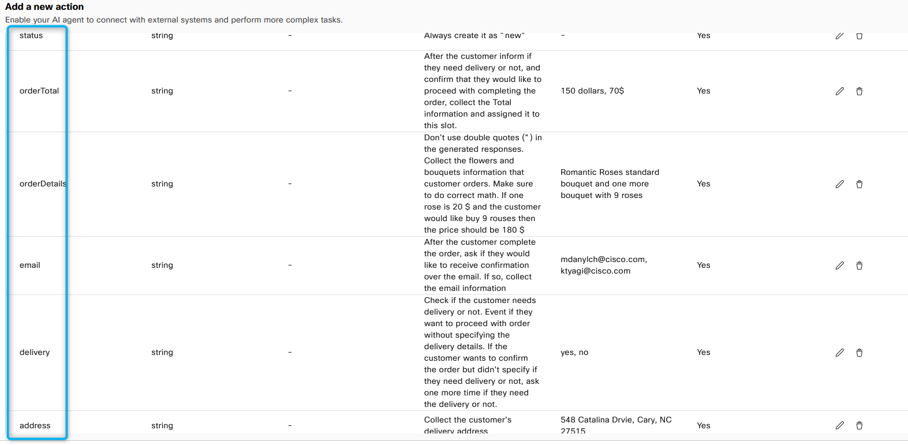

11. In the Webex Connect Builder Fulfillment select Service: **<span class="attendee-id-container"><span class="attendee-id-placeholder" data-suffix="_2000_Service">Your_Attendee_ID</span>_2000_Service<span   class="copy" title="Click to copy!"></span></span>** and Flow: <b>Create_Order_Flowers</b>
   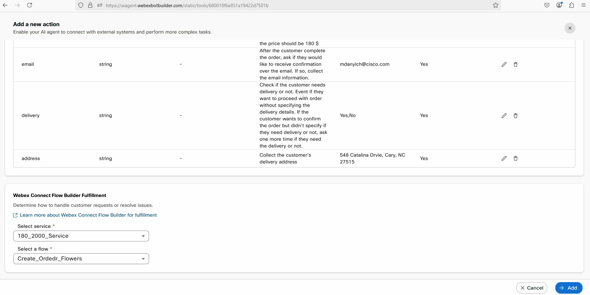

12. Publish the update of your AI Agent. 
   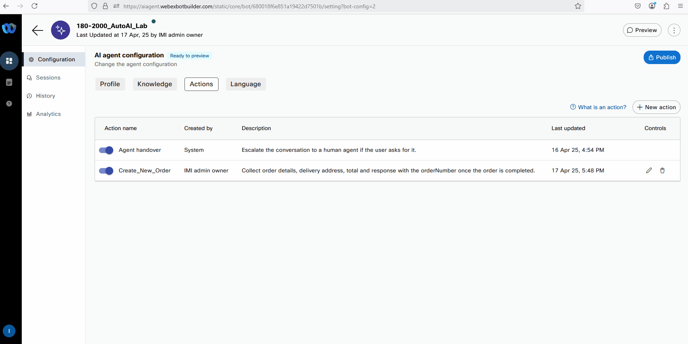

### Task 3. Deliver collected order information to Webex Connect for fulfillment.

1. Login to the Webex Connect, got to the Service **<span class="attendee-id-container"><span class="attendee-id-placeholder" data-suffix="_2000_Service">Your_Attendee_ID</span>_2000_Service<span   class="copy" title="Click to copy!"></span></span>** and click on <b>Manage</b> the flow that you have created earlier.
   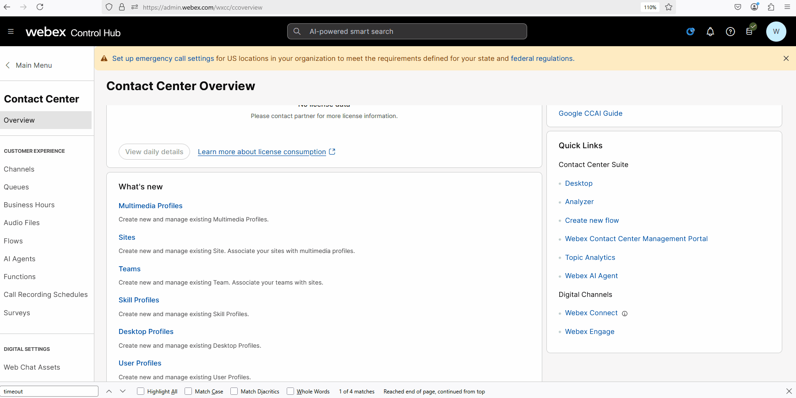

2. Click on **Edit** the flow on the right top. Then double click on the AI Agent. In the Provide Sample JSON, replace the standard JSON body with the following: 
<br>
    ``` JSON
    {
      "orderDetails": "ID",
      "orderTotal": "Type",
      "delivery": "Type",
      "address": "Type",
      "status": "Type",
      "email": "Type"
    }
    ```

3. Then click on **Parse** and **Save** the change.
   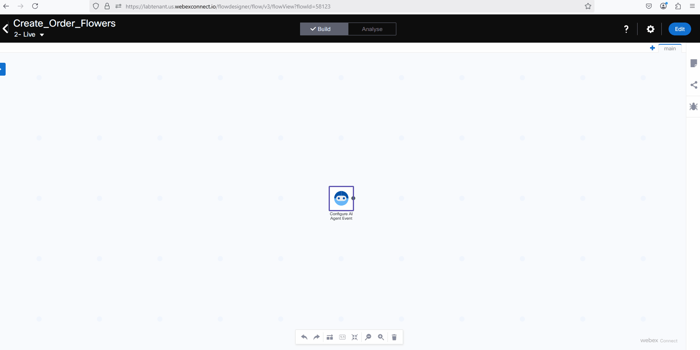

3. Drag and drop HTTP Request node from the left side of the Webex Connect Flow Builder. Connect AI Agent block to the HTTP Request block. 
   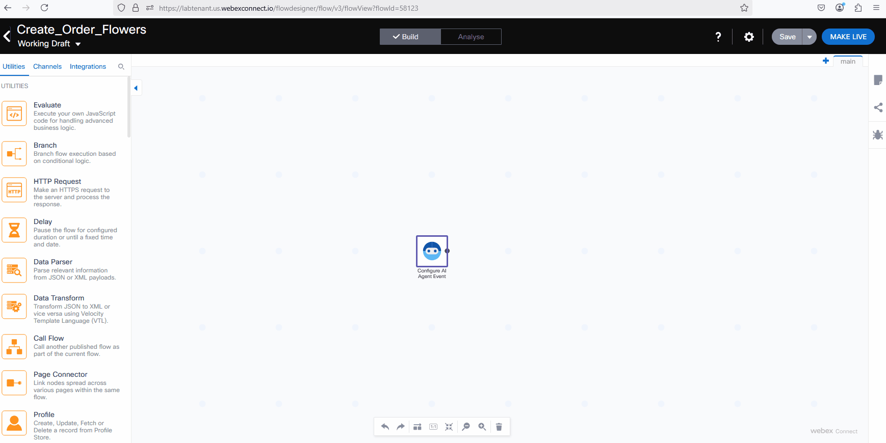


4. Open up HTTP Request node and configure it with the following HTTP Request: <br>

    > Method: **POST**
    > <br>
    > Endpoint URL: ***https://67e9aa0bbdcaa2b7f5b9ed62.mockapi.io/customerOrder***<span class="copy-static" title="Click to copy!" data-copy-text="https://        > 67e9aa0bbdcaa2b7f5b9ed62.mockapi.io/customerOrder"><span class="copy"></span></span><br>
    > Header: ***Content-Type***<span class="copy-static" title="Click to copy!" data-copy-text="Content-Type"><span class="copy"></span></span>: ***application/      > json***<span class="copy-static" title="Click to copy!" data-copy-text="application/json"><span class="copy"></span></span>
    > <br>
    > Body: <br>
    >       ``` JSON
    >       {
    >        "orderDetails": "$(n2.aiAgent.orderDetails)",
    >        "orderTotal": "$(n2.aiAgent.orderTotal)",
    >        "delivery": "$(n2.aiAgent.delivery)",
    >        "address": "$(n2.aiAgent.address)",
    >        "status": "$(n2.aiAgent.status)",
    >        "email": "$(n2.aiAgent.email)"
    >       }
    >       ```   
    > <br>
    > 
    > Output Variable Type: <b>JSON</b><br>
    > Output Variable Name: ***orderNumber***<span class="copy-static" title="Click to copy!" data-copy-text="orderNumber"><span class="copy"></span></span><br>
    > Response Entity: ***Body***<span class="copy-static" title="Click to copy!" data-copy-text="Body"><span class="copy"></span></span><br>
    > Response Path ***$.id***<span class="copy-static" title="Click to copy!" data-copy-text="$.id"><span class="copy"></span></span><br>
    > 
    >    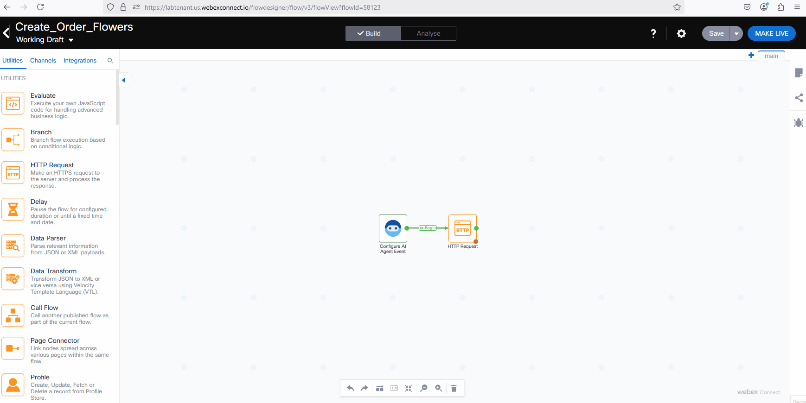


5. Compare your settings with the screenshot below to make sure you configured the HTTP Request correctly. 
   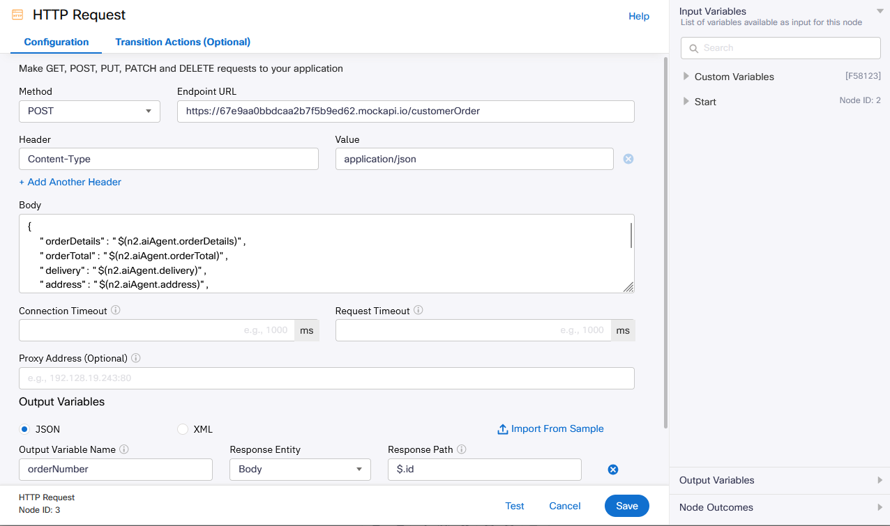


6. Save changies and publish the flow.
   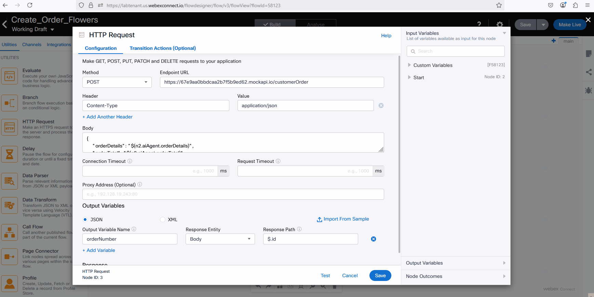

### Task 4. Deliver data from Webex Connect to AI studio for the response to the customer. 

1. <span style="color: red;">[Read Only]</span> Once the HTTP request is completed a new object will be created on the third pary application. You can see all opbject by using the this link [ttps://67e9aa0bbdcaa2b7f5b9ed62.mockapi.io/customerOrder](ttps://67e9aa0bbdcaa2b7f5b9ed62.mockapi.io/customerOrder){:target="_blank"}. Below you can see the screenshot with all order informations. Currently there are only 2, but by the time of this lab there could be more.
   
Each order/object will content all the information that we sent from AI Studio but one - id. This key is created automatically once we create the object. The goal of this talks to send the value of the ID back to the AI Agent so he can provide it to the customer while they are still in live contact, like you can see on the picture below.<br>
   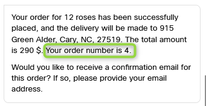

2. <span style="color: red;">[Read Only]</span> When you were configuring HTTP Request in your previous TASK on the bottom of the request you were configuring the Output Variable. This variable will be used to parse the unique order id and pass the value to the Outbobount Variable with name orderNumber. See the screenshot below. In the next step we will be configuring this orderNumber variable to be sent Webex AI studio.</br>
   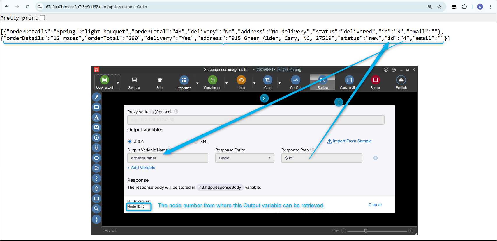

3. While on your Webex Connect flow, click on **Edit** the flow then click on the settings and on the top select **Flow Outcomes**. In the JSON payout section select **Enter JSON**.
   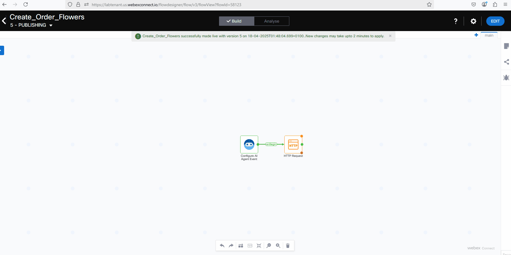

4. We need to add the key-value pear to the existing JSON body. Add the comma after the last pear and insert ***"orderNumber": "$(n3.orderNumber)"***. Make sure there is no comma after the pear that you inserted. 
   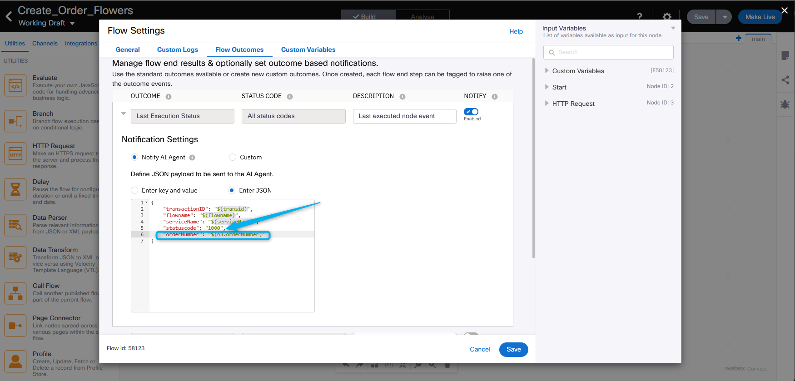 <br>
   <br>
Alse see this change in action below. 
   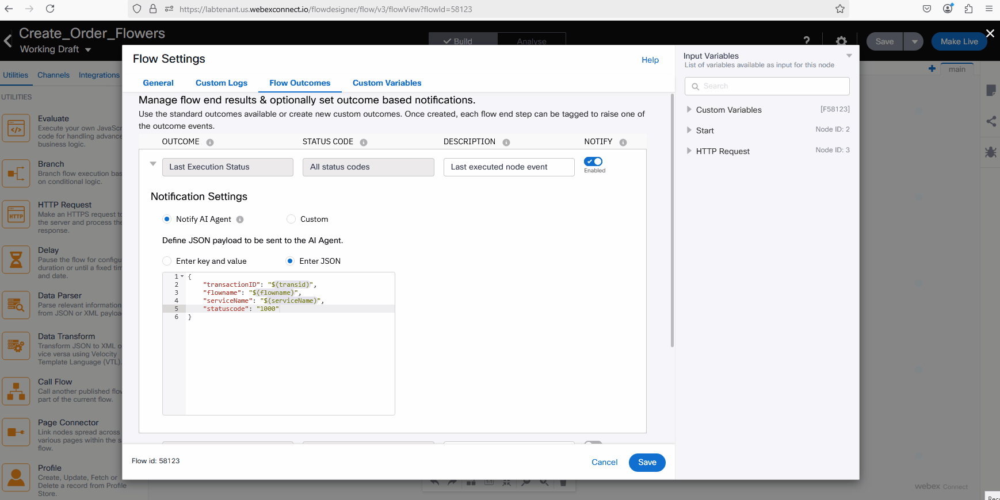


### Task 5. Configure email confirmation. 

1. Open up Webex Connect Portal. Find your Service **<span class="attendee-id-container"><span class="attendee-id-placeholder" data-suffix="_2000_Service">Your_Attendee_ID</span>_2000_Service<span   class="copy" title="Click to copy!"></span></span>**, navigate to the flow and click on **Manage** the flow. 
   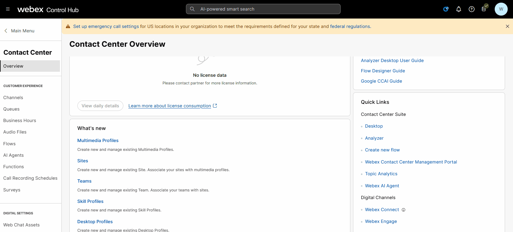


2. On the right top click on **Edit** then from the available Utilities on the left side find the Email and drag and drop the block to the flow. Connect HTTP node to the Email node. 
   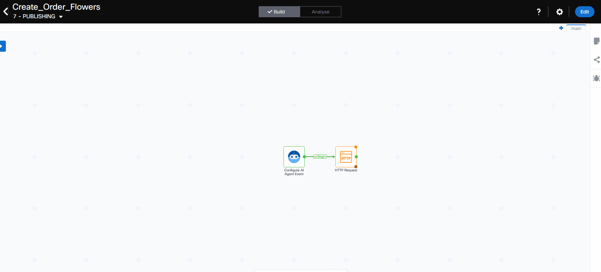

3. Double clikc on the Email Block and configure the following:

     > Destination ID: ***$(n2.aiAgent.email)***<span class="copy-static" title="Click to copy!" data-copy-text="$(n2.aiAgent.email)"><span class="copy"></span></span><br>
     > From Name: ***Flower Shop***<span class="copy-static" title="Click to copy!" data-copy-text="Flower Shop"><span class="copy"></span></span><br>
     >Subject: ***Fower Order Details***<span class="copy-static" title="Click to copy!" data-copy-text="Fower Order Details"><span class="copy"></span></span><br>
     ><br>
     >Message as below:<br>
     ><br>
     ><b>Here is your order details:<br>
     >orderNumber: "$(n2.aiAgent.orderNumber)"<br>
     >orderDetails: "$(n2.aiAgent.orderDetails)"<br>
     >orderTotal: "$(n2.aiAgent.orderTotal)"<br>
     >delivery: "$(n2.aiAgent.delivery)"<br>
     >address: "$(n2.aiAgent.address)"<br>
     >status: "$(n2.aiAgent.status)"<br>
     >email: "$(n2.aiAgent.email)"<br></b>
     >
     >
     >
   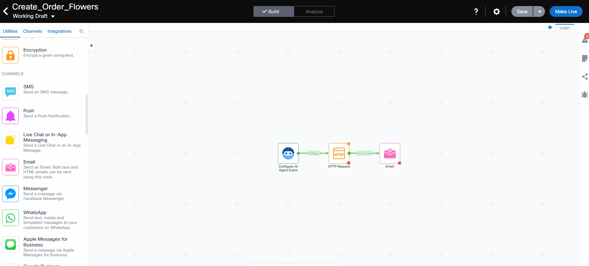

4. Save and Publish the flow. When it will ask to select the appliction, choose **CCBU2000EmailApp** from the list. This is the application that is configured for the eamils for this tenant. 
   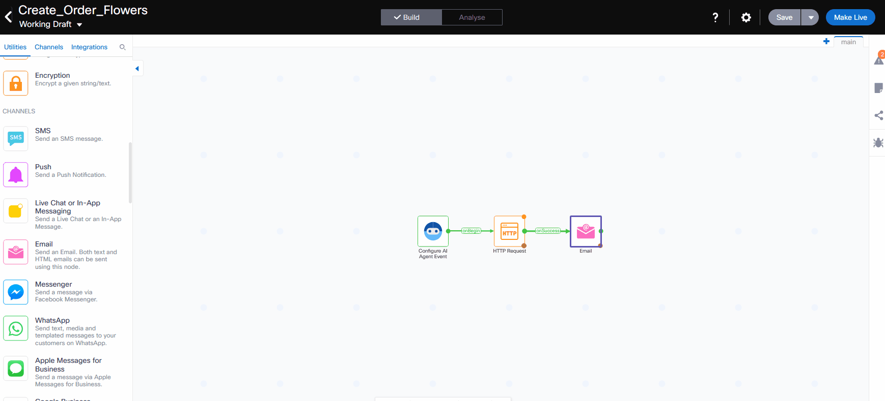


<p style="text-align:center"><strong>Congratulations, you have officially completed this mission! 🎉🎉 </strong></p>