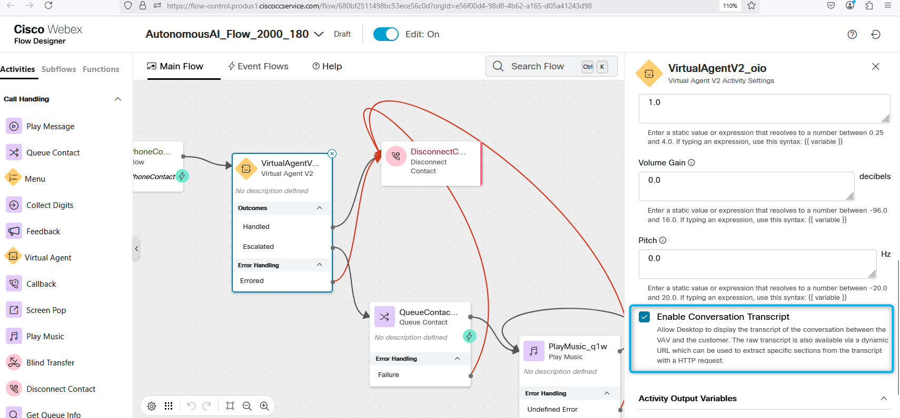
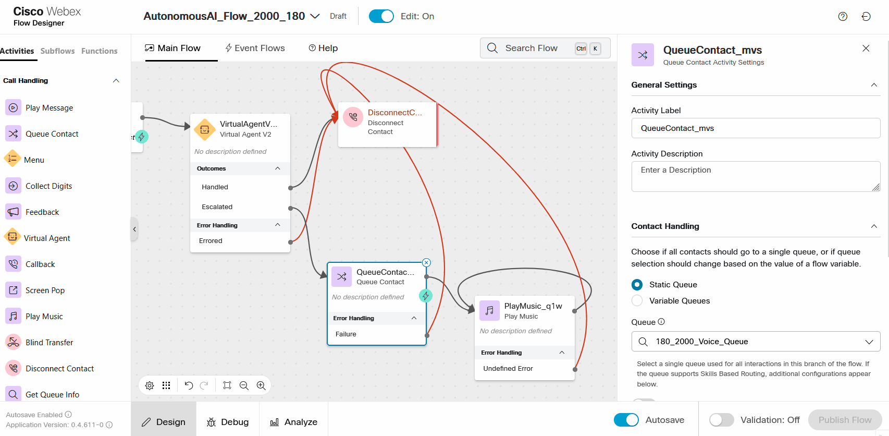
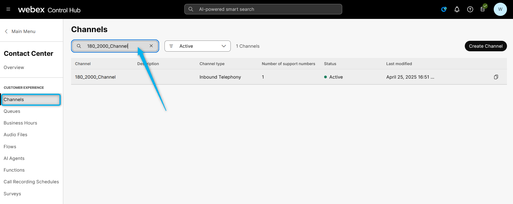
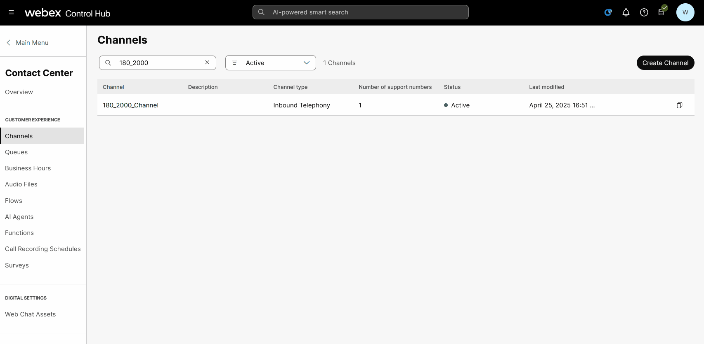
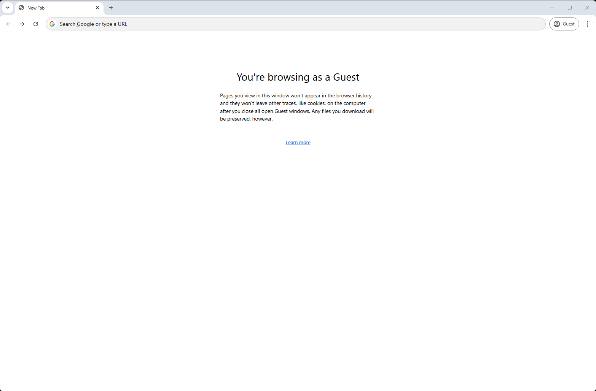
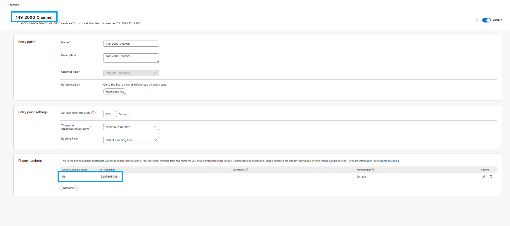
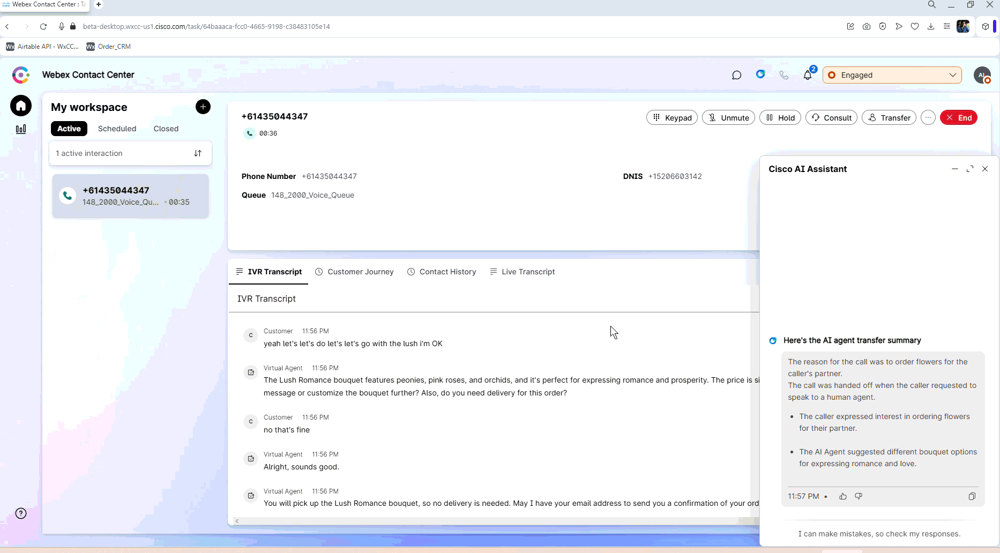

# Mission  Integrating the AI Agent with Flow for Voice Calls

## Mission overview
Your mission is to:

Integrate the AI Agent with the Voice Flow. 

### Task 1. Build WxCC voice flow with AI Agent. **Mostly Read ONLY - flows have been created for you but not published**

1. In Control Hub navigate to **Flows**, in the Search bar above the list, search for **AutonomousAI_Flow_2000_Your_Attendee_ID**

2. Towards the extreme right of your listed flow, click on the edit button to launch the flow in Flow Designer

3. Make sure the **Edit** mode at the top is set to **ON**. Then, click on the **Virtual Agent V2** select **Static Contact Center AI Config** on the right
    >
    > Select Contact Center AI Config as **Webex AI Agent (Autonomous)**
    >
    > Virtual Agent: **Your_Attendee_ID_2000_AutoAI_Lab**
    
    Information ONLY By default, the **Conversation Transcripts** setting is enabled in VirtualAgentV2 block.
    

4. Click on the QueueContact block and choose the queue for your attendee ID **Your_Attendee_ID_2000_Voice_Queue**

5. Click on the **Play Music** block and choose **defaultmusic_on_hold_cisco_opus_no_1.wav**
    

  

6. **Validate** and **Publish** Flow. In popped up window click on dropdown menu to select **Latest** label (**DO NOT** Select any other tag but only **Latest**), then click **Publish**.
    

7. Assign the Flow to your **Channel (Entry Point)** - Do this by first going to **Channel** > Search for your channel **Your_Attendee_ID_2000_Channel**.

8. Click on **Your_Attendee_ID_2000_Channel**
    

9. In **Entry Point** Settings section change the following:

    > Routing Flow: **AutonomousAI_Flow_2000_Your_Attendee_ID**

    > Version Label: **Latest**

    > Music on Hold: **defaultmusic_on_hold.wav**

    

10. Dial Support Number assigned to your **Your_Attendee_ID_2000_Channel** to test the Autonomous AI Agent over a voice call. When speaking the Email address and Delivery Address - use NATO phonetic alphabet like "A for Alpha, B for Bravo" etc.
> **Note:** This Lab is being conducted in a classroom with more than a few attendees.  
> Environmental factors, such as background noise and other attendees speaking next to you, may affect the response accuracy.  
> For best results, it is **strongly recommended to use computer headphones**, if available.

### Task 2. Test Agent Handoff Configurations.

1. Click <a href="microsoft-edge:https://beta-desktop.wxcc-us1.cisco.com">Launch Agent Desktop in Edge</a>.
   Or you can copy paste this URL to the Edge browser's address bar: https://beta-desktop.wxcc-us1.cisco.com Use the same **Agent** credentials on your card. You will see another login screen with OKTA on it where you may need to enter the email address again and the password provided to you. 
2. Select **Desktop** endpoint option and choose the team. **Your_Attendee_ID_2000_Team**. Click **Submit**. Allow browser to access Microphone by clicking **Allow** on every visit.
3. Make your agent ***Available*** and you're ready to make a call.

    

4. From the Webex app dial pad, dial the +1 US Number assigned to you. This should have already been mapped to your **Your_Attendee_ID_2000_Channel** channel, and during the conversation with the AI agent, ask to talk to a representetive or live agent. Just say "Can I speak to an agent?"
    

5. With this setting enabled, the live agent can see the conversation details between the caller and the AI agent. Please check if you can view the IVR transcripts during your test calls with Agent Handoff. 
    

<strong>Congratulations, you have officially completed the Autonomous AI Agent lab! 🎉🎉 </strong>

