## Mission Objective

In this mission, you need to complete web chat configuration tasks, including creating a Chat Asset, linking it to a Channel, and test website.
## Build

### Task 1. Find your Service.
1. Login to Webex Connect Portal.
Go to **Services** and look for the service that you have created earlier. The name should be **Your_Attendee_ID_2000_Service**
   

### Task 2. Configure and Register Chat Asset.

1. While on Webex Connect portal, go to ***Assets*** -> ***Apps***, press ***Configure New App*** and select ***Mobile / Web*** option.
   

2.  Input ***Name*** as **Chat_App_Your_Attendee_ID_2000**

3.  Toggle/enable ***Live Chat / In-AppMessaging*** to ***ON*** and choose ***Primary Transport Protocol*** as **`MQTT`** & ***Secondary Transport Protocol*** as **`Web Socket`** then tick ***Use Secured Port*** checkbox and press ***Save*** button.
   
>**Note**: If there is an error that your request cannot be processed, please press ***Save*** button one more time.

4.  Once asset is saved, press ***Register To Webex Engage*** at the top. 
   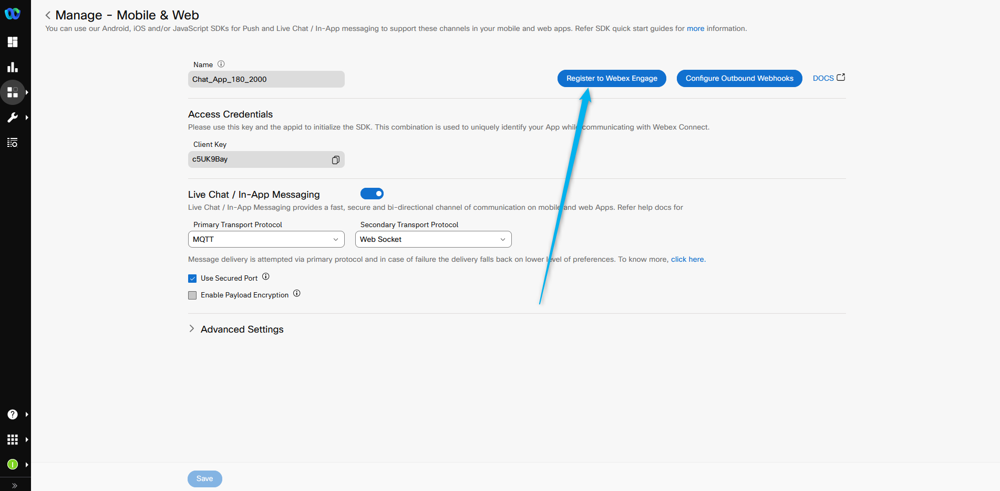

5. Choose **Your_Attendee_ID_2000_Service** from the drop-down list and press ***Register*** button.
   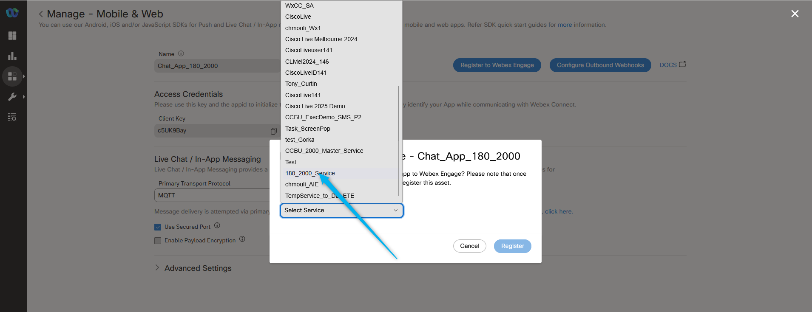

6.  Check and make sure the asset has been succesfully registered to the service and  ***Register To Webex Engage*** button has been greyed out.
   

7.  Return to ***Assets*** -> ***Apps***, find ***ChatAsset***, copy ***App ID***, paste it into the text file and save. We will use it when configuring chat flow later.
   

### Task 3. Create Entry Point for Chat

1. Login to Control Hub and go to Channels and click on **Create Channel**.
   

2.  Input ***Name*** as **Your_Attendee_ID_2000_Chat_Channel**
   

3. Select **Chat** from the ***Channel Type*** drop-down list. Select **Chat_App_Your_Attendee_ID_2000** as an ***Asset Name***. Set ***Service Level Threshold*** as **`360`** and click on **Save**.
   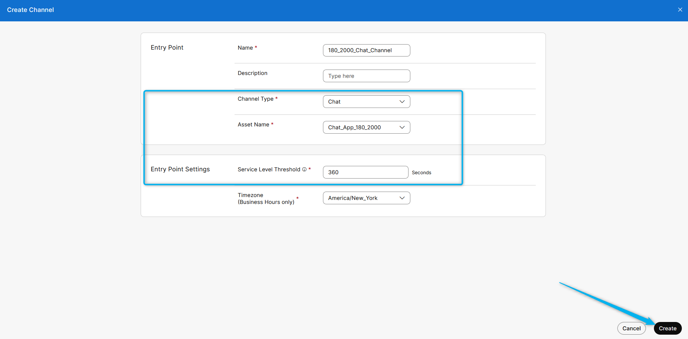

### Task 4. Create Queue for Chat

1.  While on the **Control Hub** portal go to Queues and click on **Create a queue**.
   

2. Input ***Name*** as **Your_Attendee_ID_2000_Chat_Queue**. Also select **`Chat`** in the ***Channel Type*** section.
   

3. Scroll down to **Chat Distribution** click on ***Add Group*** and select **Your_Attendee_ID_2000_Team**
   

4. Set ***Service Level Threshold*** as **`7200`** seconds (2 hours). Set ***Maximum Time in Queue*** as **`10800`** seconds (3 hours). Click on ***Save*** after comparing your values with the screenshot below.
   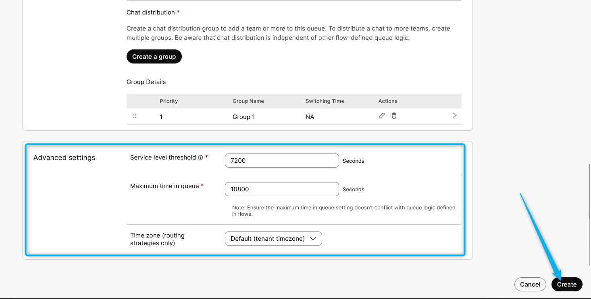

### Task 5. Website Widget Configuration

1.  Login to Webex Engage Portal.
   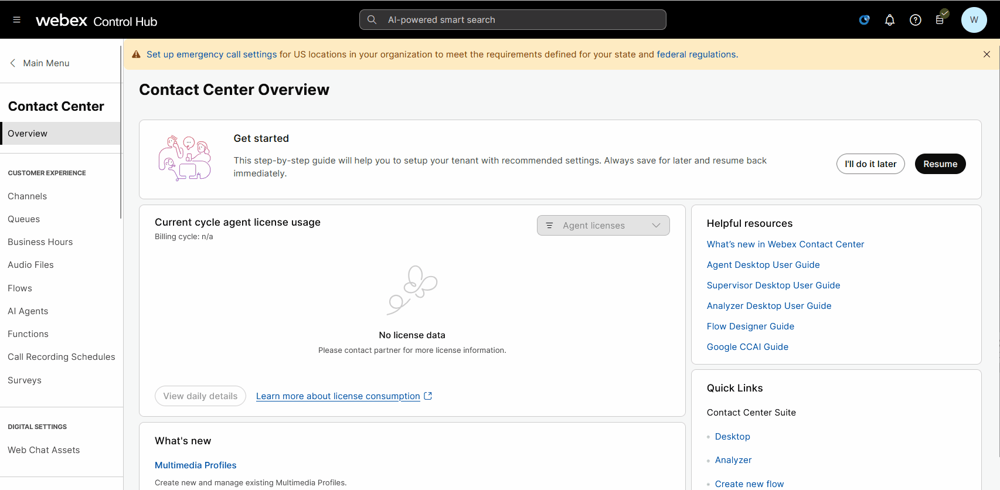

2.  Go to ***Assets*** -> search and edit **Chat_App_Your_Attendee_ID_2000** which you have created in Connect Portal.
   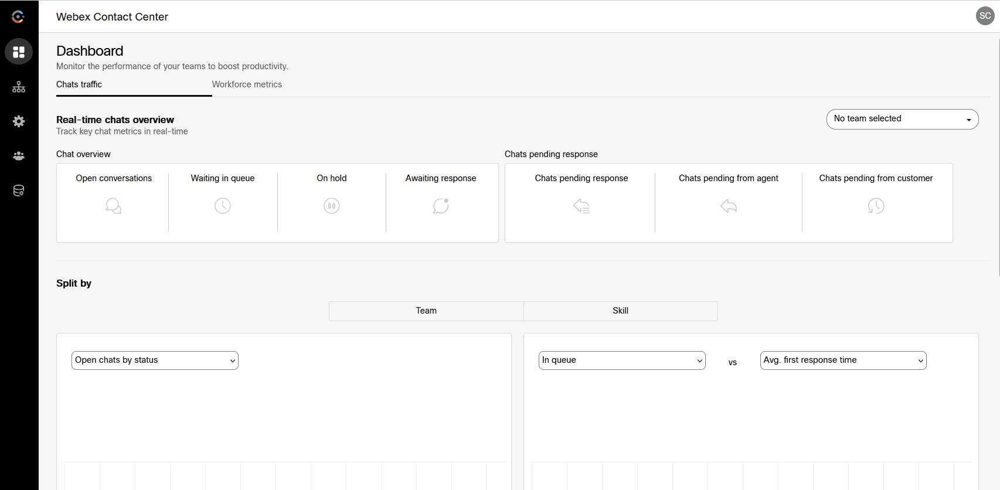

3. Scroll down and click on ***Save Changes*** button.
   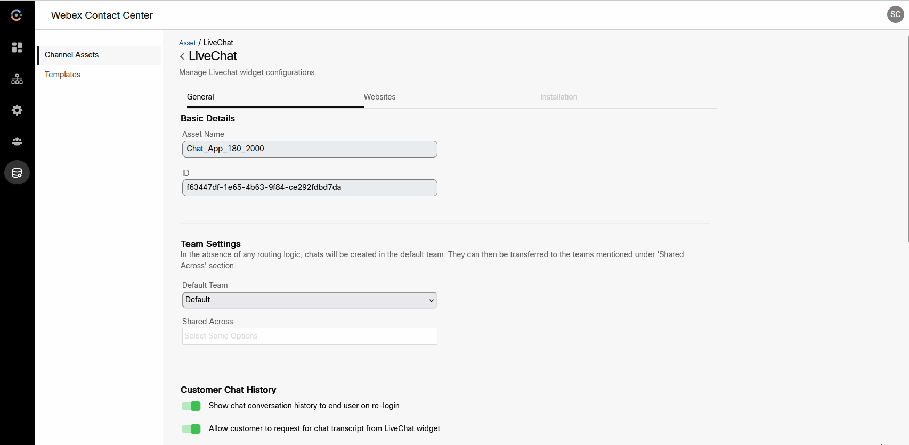

4.  Scroll to top of the page and choose ***Websites*** tab. Click on ***ADD Website***.
   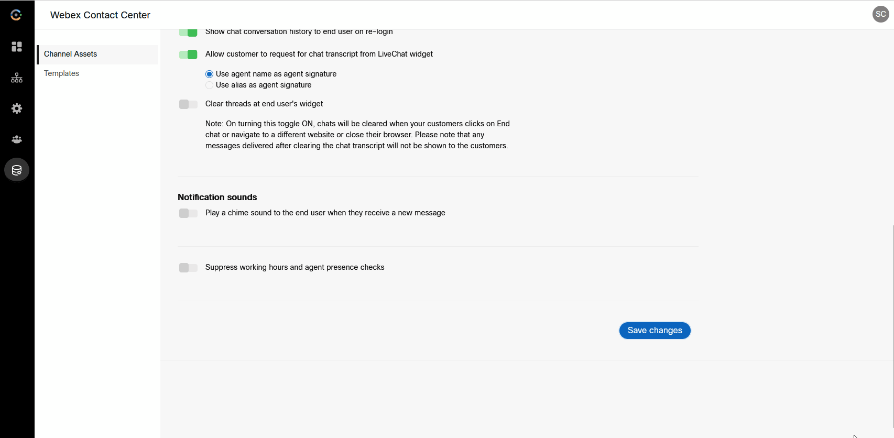

5.  Fill in the respective fields as per the table below:

    | **Parameter Name**                | **Parameter Value**            |
    | ----------------------------- | -------------------------- |
    | Chat Widget Language          | English-US                 |
    | Display Name                  | Flower Shop                |
    | Byline Text                   |                            |
    | Button Text                   | Start Chat                 |
    | First message                 | Hello! Welcome to the chat |
    | PCI Compliance Banner Message | This chat is PCI compliant |
    | Domain                        | *.glitch.me                |
    | Set wait time                 | Disabled                   |
    | Set Chat Announcement         | Enabled                    | 

6. Review the configurations and **Save changes**
   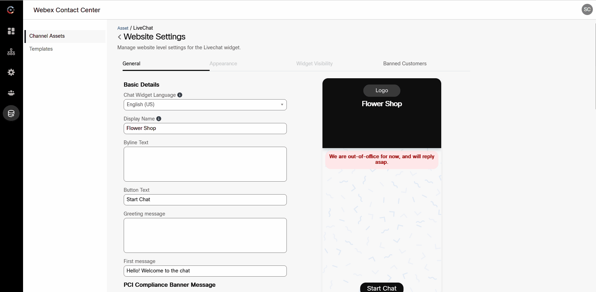

7.  Scroll up, select ***Appearance*** and change the settings:
	- \[Optional\] Widget Color
	- \[Optional\] Widget Button Type
	- \[Optional\[ Logo
	- Enable Emojis
	- Enable Attachments
  Press ***Save changes*** button at the bottom of the page.
     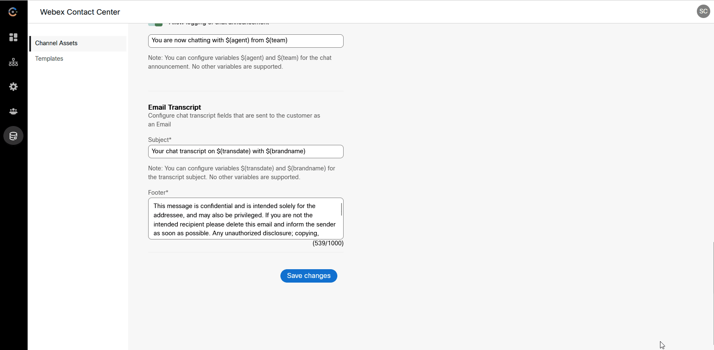

 
8.  Scroll up, select ***Widget Visibility*** tab and make sure that ***Force Turn Off Widget*** switch is disabled.  Then select ***Widget Visibility*** as ***Show without any restrictions*** and save changes.
     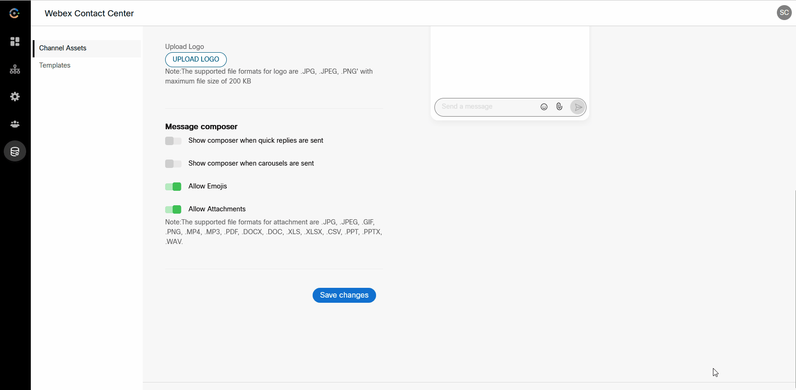

9.  Now click on ***<*** arrow near ***Website Settings*** and go-back to edit your chat asset.
     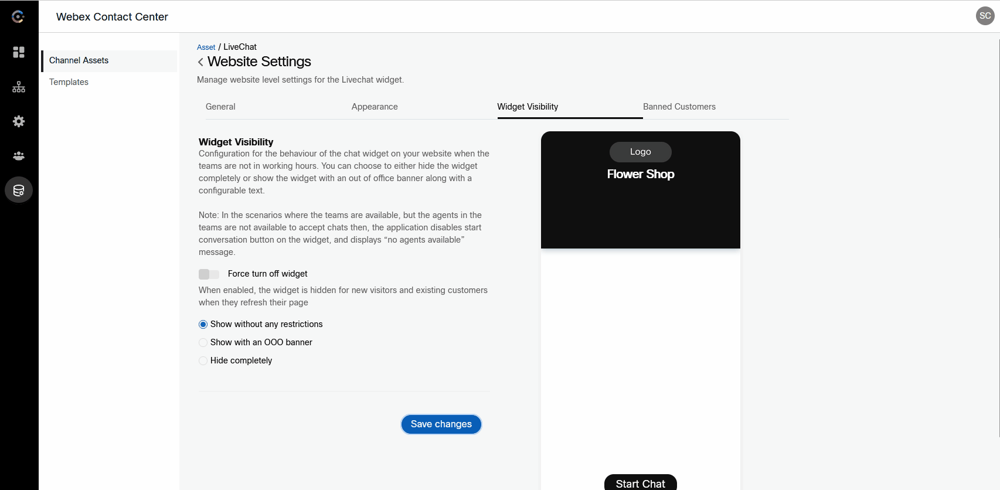

10. Select ***Installation*** then click on ***Copy*** to copy the chat script to clipboard.
     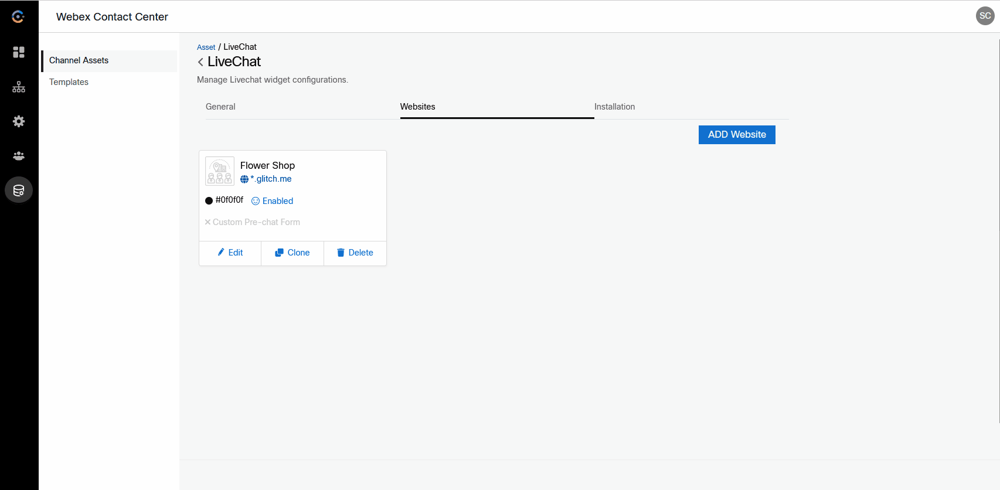

### Task 6. Paste the script to the test website. 

1. In this lab, we are using the glitch.com platform to test our chat functionality on a sample website. Using your personal gmail plesae login to glitch.com and create your own custom website where you can embed the chat widget. Open index.html file to see the structure of the website. 
     

2. While having index.html file open, copy the script that you have save in notepad in the prevouse Task and paste it between ***footer*** and ***body*** tags. 
     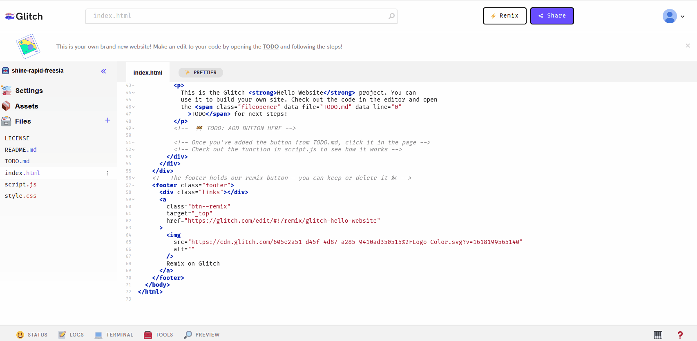

4. Click on the website preview, and you should see the chat bubble appear in the bottom-right corner.
     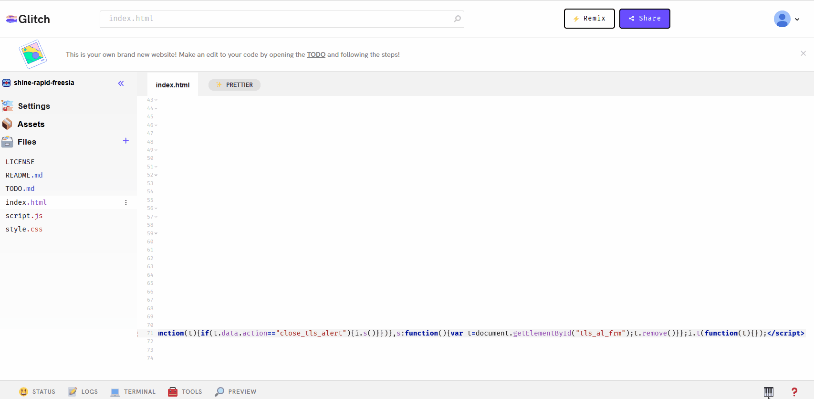

