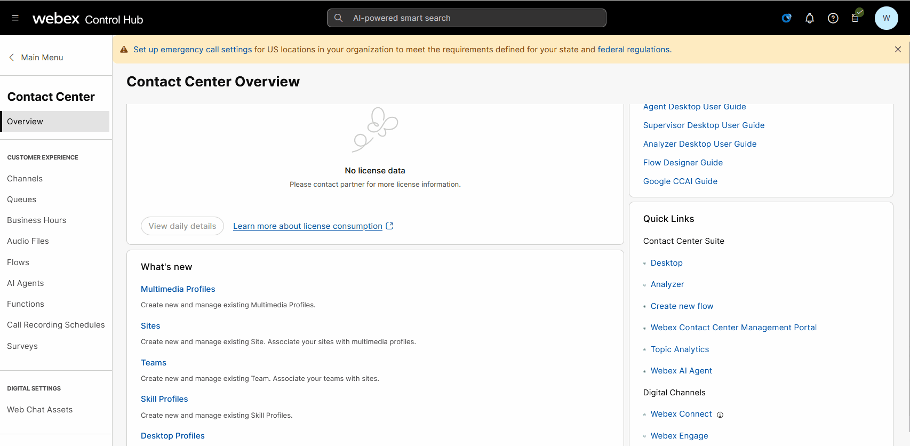
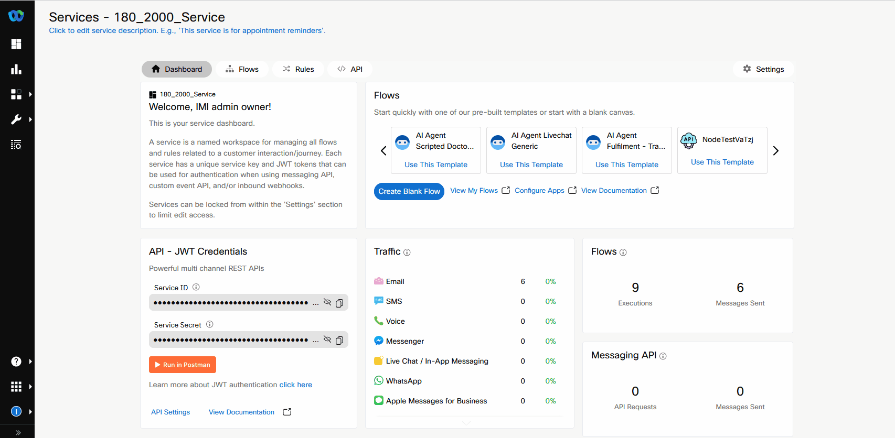
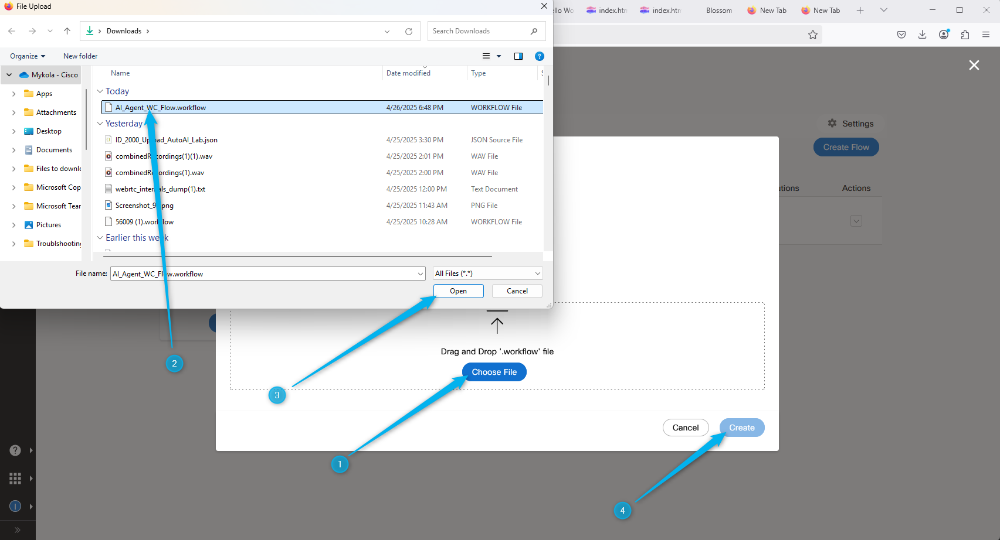
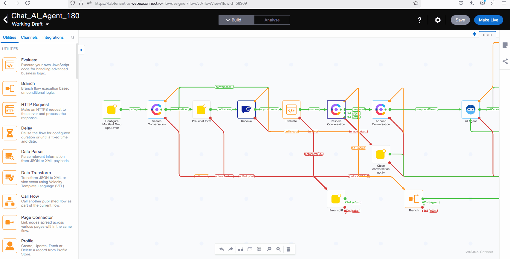
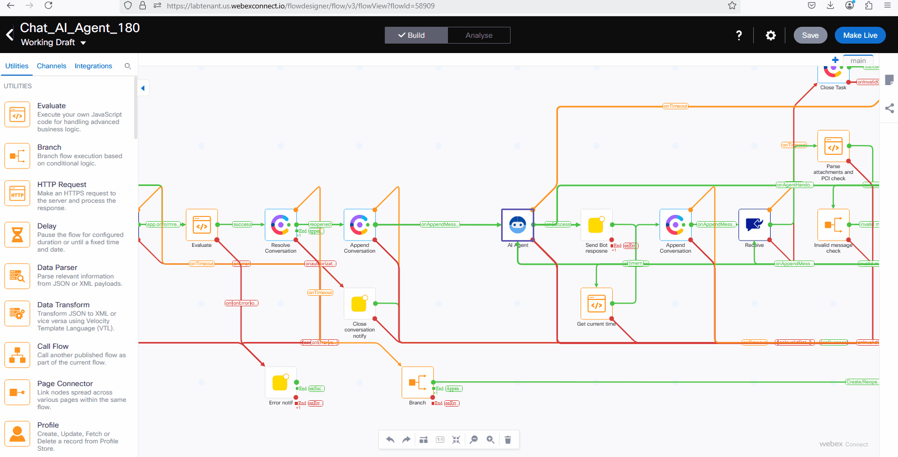
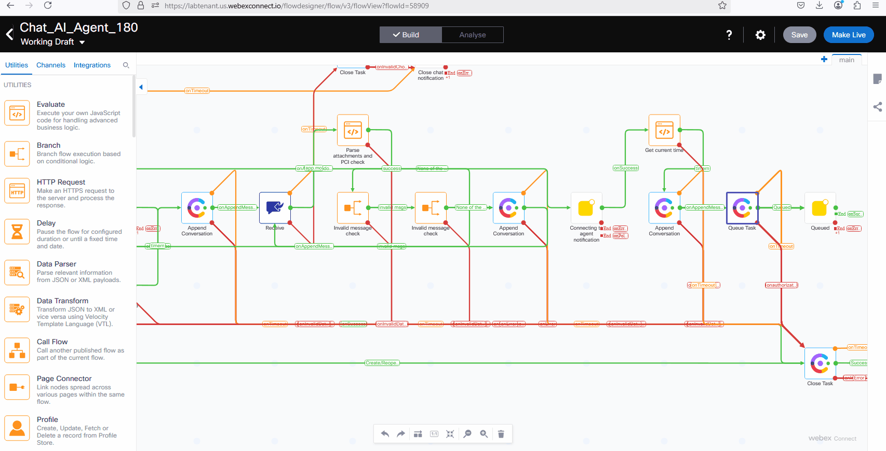
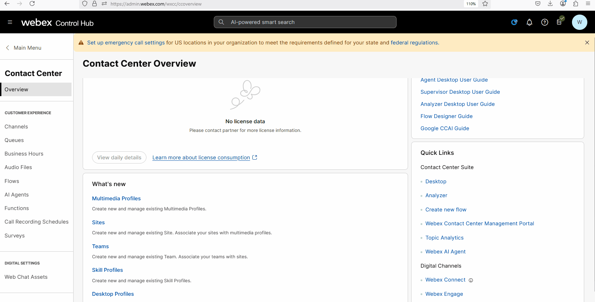
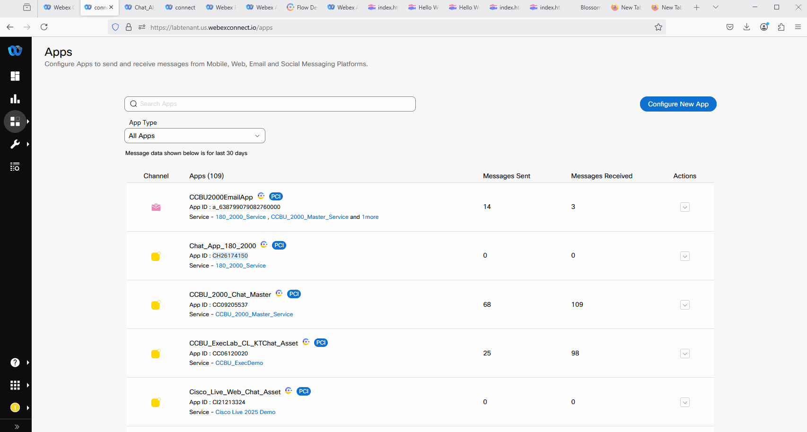
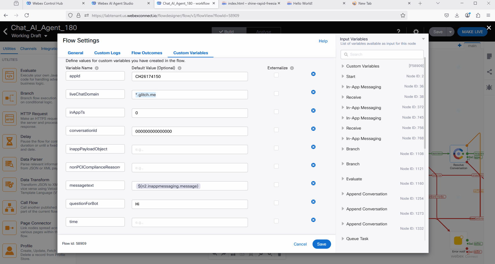
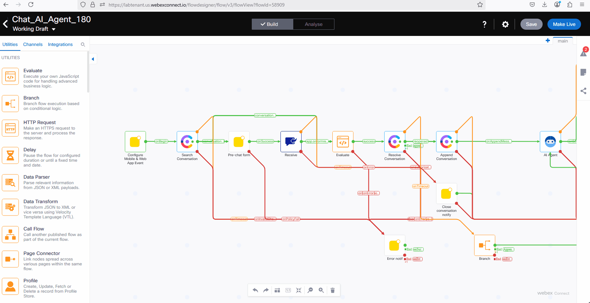

## Mission Objective

In this mission, you will download the Webex Connect flow and configure it to work with you Webex AI agent. 

## Build

### Task 1. Create New Webex Connect flow from template. 

1. Download the Webex Connect flow using the following link:
[Webex Connect Flow](https://cisco.box.com/s/w1iqxeeoz2k6abl68lhmhijv9g0jtcy5){:target="_blank"}

2. Go to Webex Connect portal and open your service with the name **Your_Attendee_ID_2000_Service**
   

3. Click on **Flows** and then click on **Create Flow**.
   

4. Name the flow as **Chat_AI_Agent_Your_Attendee_ID** and select **Upload flow** option from the list.
   

5. Click on **Choose File**, select the fild that you have downloaded in the step 1, then click on **Create**.
   

6. On the following page click on **Save**
   

### Task 2. Configure the Webex Connect Flow. 

1. Open up **Resolve Conversation** block and configure the **Flow Id** with the same that you can find in the URL. Click on **Save**.
   

2. Open up **AI Agent** block and select from the list the AI Agent that you have created earlier. The name can be **Your_Attendee_ID_2000_AutoAI_Lab**
   

3. Open up Queue Task and select the queue **Your_Attendee_ID_2000_Chat_Queue** from the list that is related to your config. 
   

4. Open up New Webex Connect Window, go to Applicaitons and find the AppID that is related to your Chat Application with name **Chat_App_Your_Attendee_ID_2000**
   

5. Go to your Webex Connect Flow, open up **Flow Settings**, click on **Custom Variables** and adjust the appID with the one you copied in the previous step. 
   

6. For better tracking purposes, also change the **liveChatDomain** in the **Custom Variables** settings from *.glitch.me to the website that is associated with your user account. For example for my test account it is shine-rapid-freesia.glitch.me. For your account please refare the table below. [NEED to Add Table] 
   

6. Open the first **Receive** node and **Save** it.
   

7. Open the second **Receive** node and **Save** it.
   

8. **Save** and **Make Live** the flow. On the following page, select the Chat Application that you have created earlier. The name can be **Chat_AI_Agent_Your_Attendee_ID**.
   

9. If you noticed any error while making the flow Live, please wait until the flow is published and publish it one more time. 
   

