### Mission Details

Your mission is to review preconfigured Scripted AI Agent for tracking existing order. If you would like to build it by yourself there are BONUS Missions 3,4,5 and 6 of this lab. 

### Build

#### Task 1. Review the Configurations in AI Studio to track an order. 

1. Go to AI Studio and open AI Agent with name ***180_Scripted_AI_Agent***. 
**Please do not making any changes to this agent, as this lab is for review purposes only for the entire group.**

     

2. Below is the diagram for tracking order flow. If the caller asking to track an order, **track_order** intent should be used as it has utterances like **Can you track my order** and others. This intent is configured to collect required **Entity**, for this the interaction will be moved to the interim response with name **order_number**.  
     

3. Open up ***180_Scripted_AI_Agent***
 AI agent. Click on **Script > Intents** and then open up **track_order** intent. 
     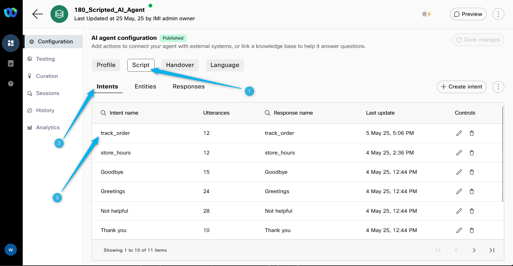 

4. If this intent is triggered (customer request matches the Utterances), then system will initiate the response **order number** until the required entity is filled or the number of retries is exceeded.
     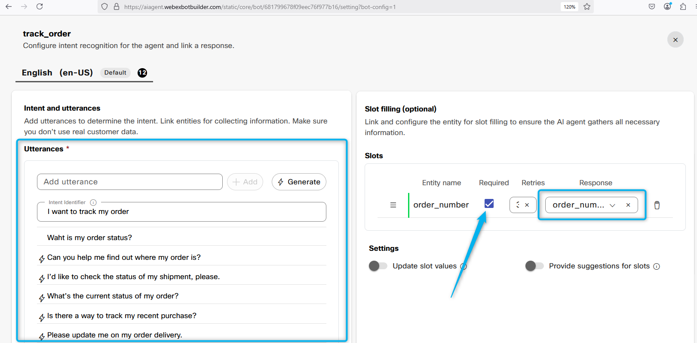 

5. Once the entity is filled, the system initiates the final response for this intent. In this case, it is **track_order**.
     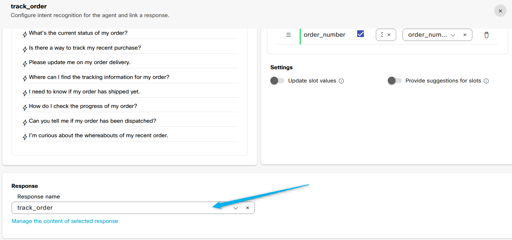 

6. Click on Entities and review **order_number** Entity configuration. 
     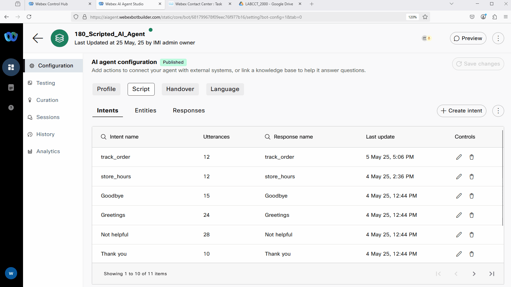 

7. Click on **Responces** and seach for **order_number** responce and review it for responce message  
     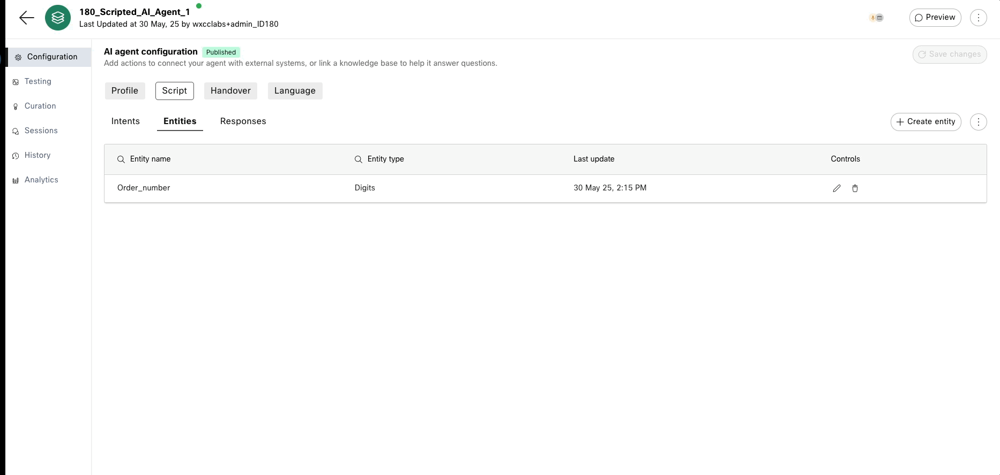 

#### Task 2. Send the data from AI Agent to Voice Flow​.

1. Click on **Responses** and open up response with name **track_order**
     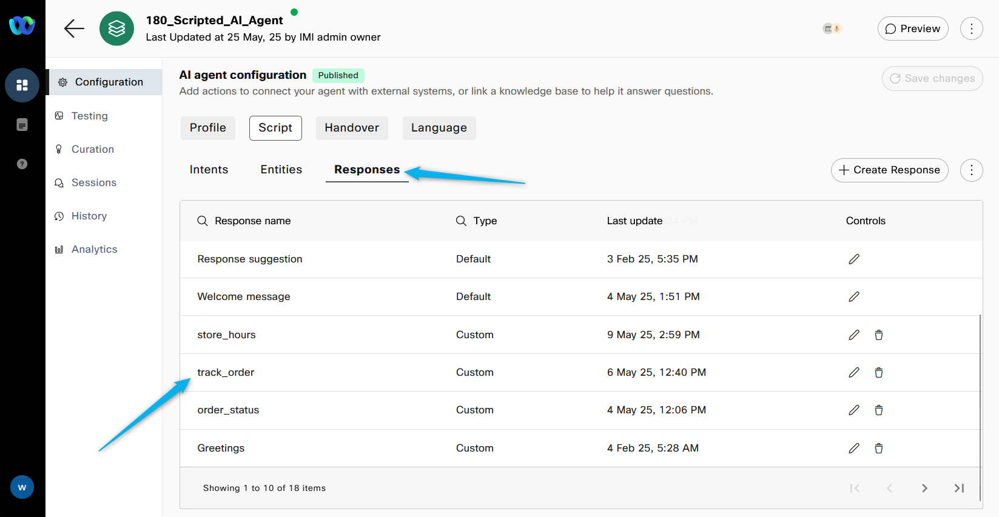 

2. Review the response configurations. 
     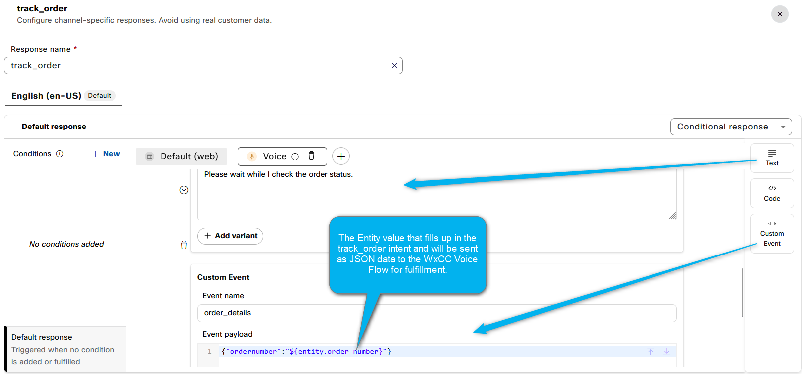 

3. Go to [Control Hub](https://admin.webex.com){:target="_blank"} > Contact Center. Click on **Flows** and open the flow with name ***Autonomous_Scripted_Flow_2000_180***.
     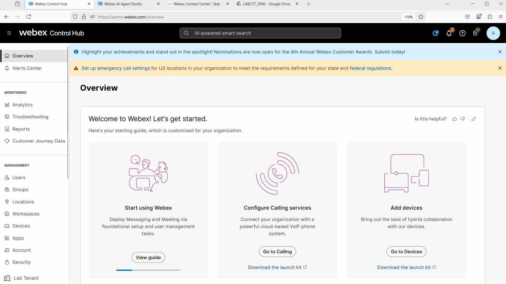 

4. Click on the lower VirtualAgentV2 block. You will see the Activity Output Variables. The Entity value can be found in VirtualAgentV2.MetaData. 
     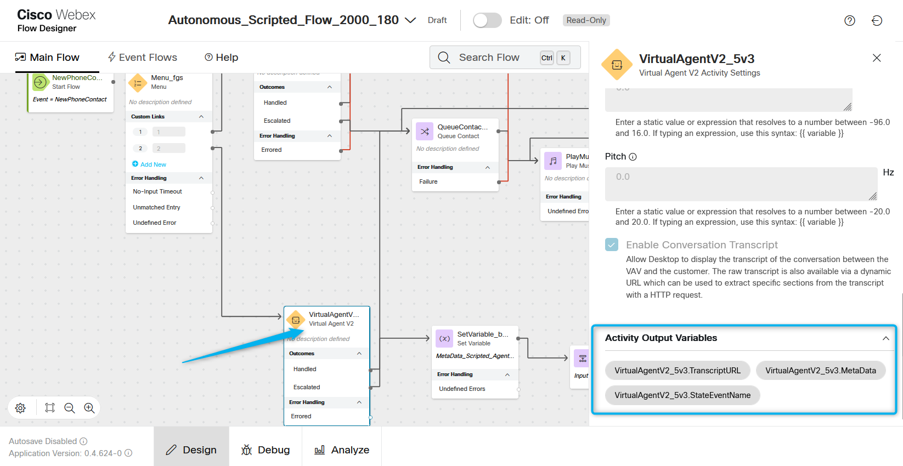 

5. Click on the next **SetVariable** block and you can see that we just assigned the value from Activity Output Variable from the previous **VirtualAgentV2** block to the flow variable with name **MetaData_Scripted_Agent**. This is an optional step. 
      

6. Click on **Parse** block. It is configured to parse data from **MetaData_Scripted_Agent** variable using JSON path **$.ordernumber** and assign the respon to the flow variable with name **order_id**.
     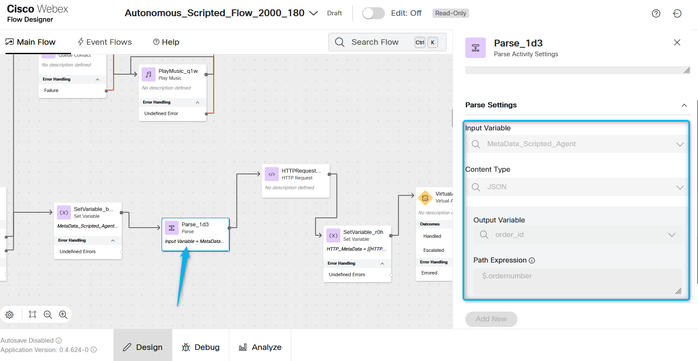 

7. Open up **HTTP Request** block. It is configured to send **GET** request with the parameter as the order_id value to retrive the response specifically for this order. 
      

8. If we would do the same request from Postman for the order Id 17, here is the information we would get. 
     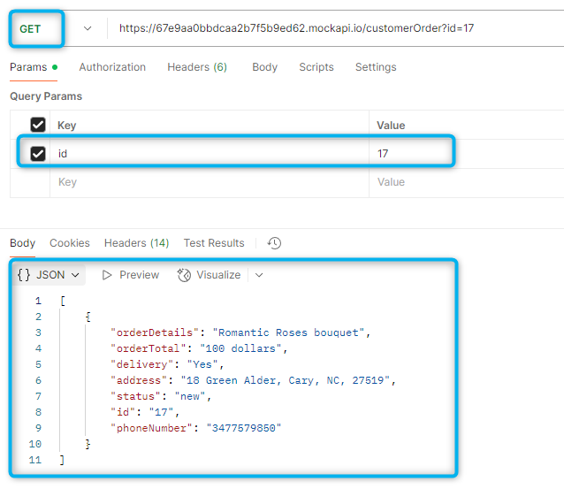 

9. While on **HTTP Request** node, scroll down and you will see the configurations to parse the data from the response. It is configured to use JSON path **$.[0].status** and assign the response to the variable with name **order_status**.
     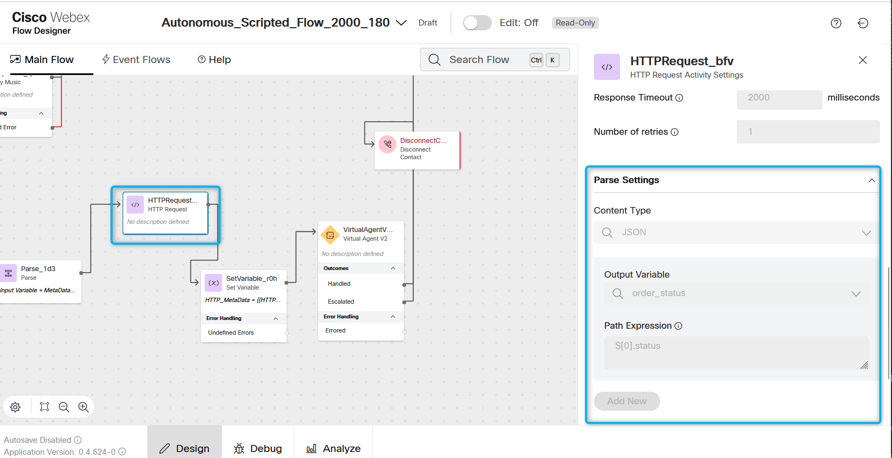 

10. For example if I would need to parse the status of the order 17 using this JSON path, the result would be "new".
     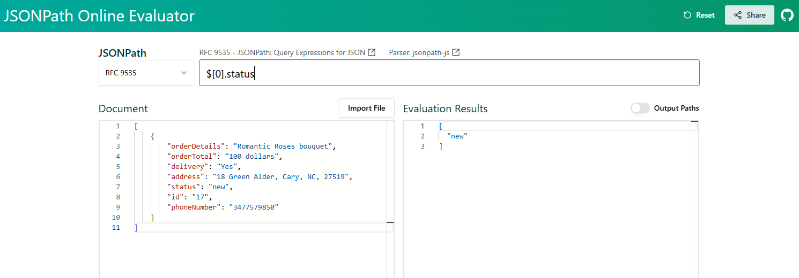 

#### Task 3. Send the data from Voice Flow to AI Agent. 

1. To send data back to AI Studio we need to use one more VirtualAgentV2 block. Click on it to review configurations. You can see that we use the same Scripted AI agent **180_Scripted_AI_Agent**, but we also configured the **State Event**. The **Event Name** will refer to the response on AI Studio. And the **Event Data** contains the result of the **order_status** that can be retrieved in the AI Studio.
     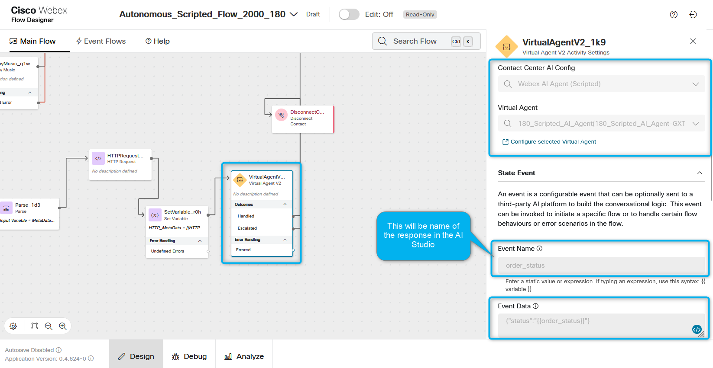 

2. Go to AI Studio and open AI Agent with name ***180_Scripted_AI_Agent***. **Please do not make any changes to this agent, as this lab is for review purposes only for the entire group.**
     

3. Open the response with the name **order_status**. The same name was specifed in the VirtualAgentV2 block as the **Event Name**. 
     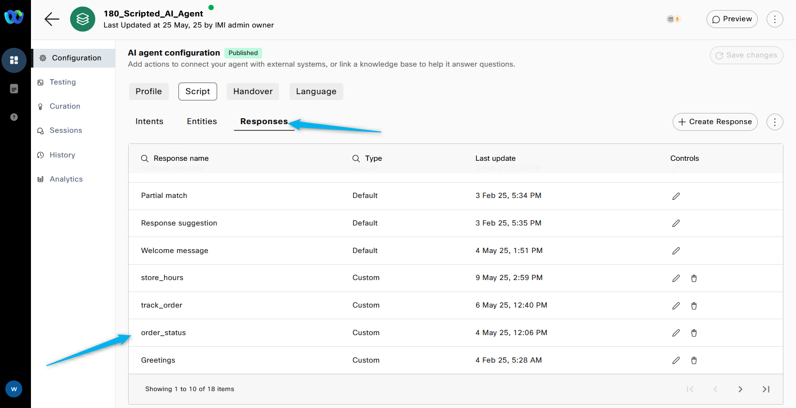 

4. Open up the response and you can see that data will be returned using the following format: **${eventStore.status}**.
     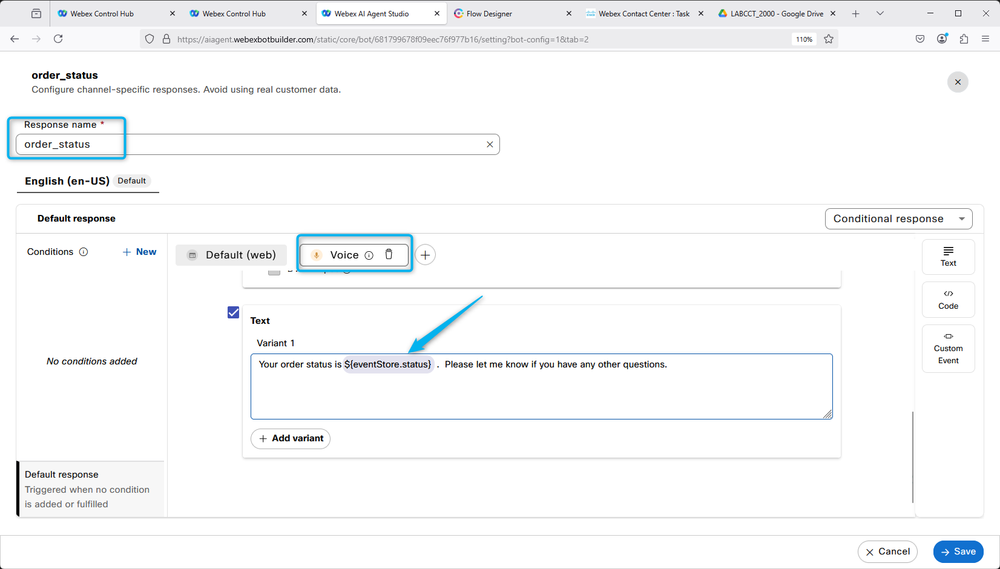 

#### Task 4. Place test call and review the trace. 

1. Call the number +15206603129 that is configured to deliver the call to the flow **Autonomous_Scripted_Flow_2000_180**.
     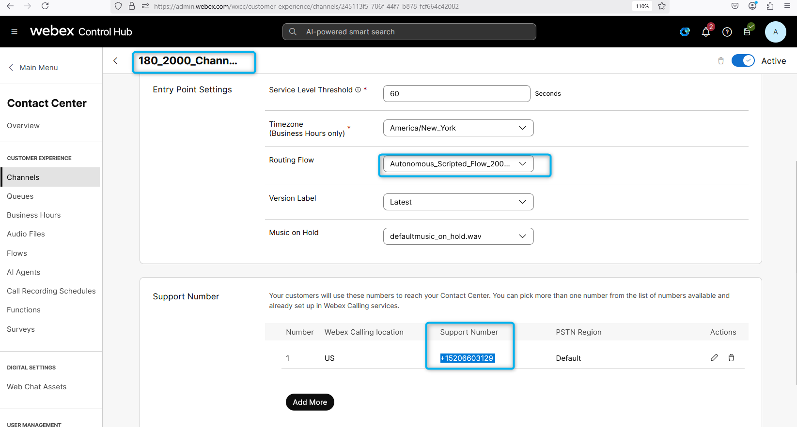 

2. Press 2 to go to the Scripted AI agent. Ask to track your order. Provide the order number as 17 or any other order that you created earlier. You should hear the response that the order status is "new".

3. Open up Debug mode in the flow **Autonomous_Scripted_Flow_2000_180**.
      

4. Review the trace. 
     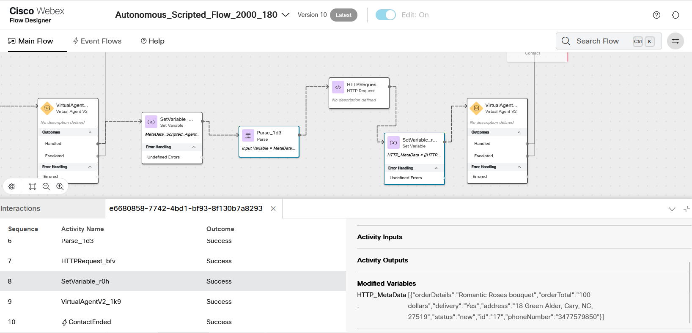 

5. In the AI Agent Studio, go to Sessions and review the traces. 
     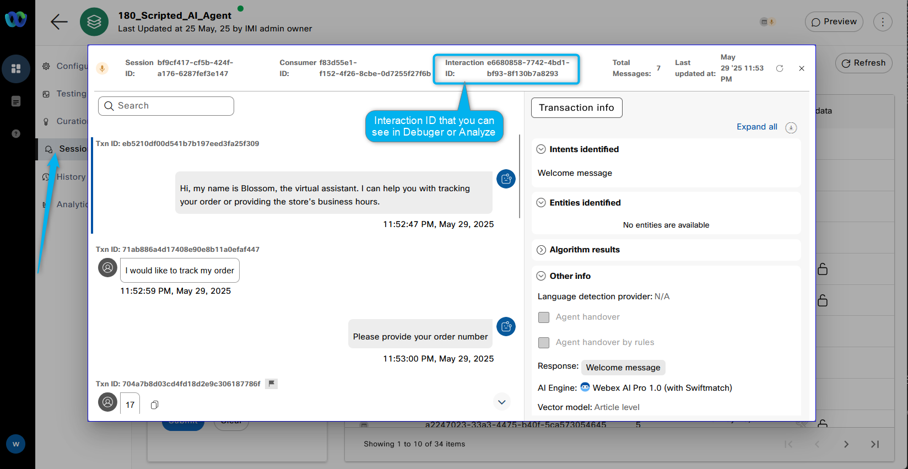 

<strong>Congratulations, you have officially completed this mission! 🎉🎉 </strong>
