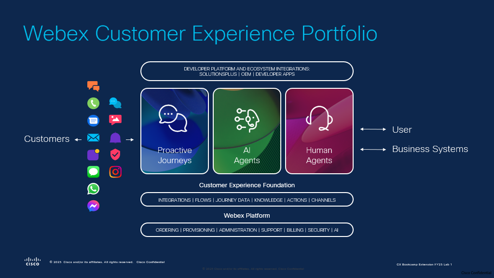

<!-- Markdown content with embedded HTML -->

    <h2>Please put in your Attendee ID into the box below and click Save.</h2> 
    <form id="attendee-form">
        <label for="attendee">Attendee ID:</label>
        <input type="text" id="attendee" name="attendee" placeholder="Enter 3 digits" required>
        <button type="submit">Save</button>
    </form>

     

    
Your stored Attendee ID is: <b>No ID stored</b>

    
<h3>All configuration entries in the lab guide will be renamed to include your Attendee ID.</h3>

# Overview
Building an AI agent is as easy as ordering flowers!
We will begin with building a voice Autonomous Agent that will help the caller order flowers for their partner. It could be an anniversary or other occasions. The agent will also capture email address, shipping address, offer choices etc.
We will get the agent to capture and store the booking in a database.
We will then hook it up the voice flow and interact with it.
We will also build Scripted AI Agent to do specific tasks like fetching status of the order.

## Learning Objectives   

 **• Integrate Intelligent AI Agents:** Utilize Cisco Autonomous and Scripted AI Agents to build dynamic, context-aware self-service flows that adapt to customer needs in real-time.   
**• Seamless AI-to-Human Collaboration:** Experience smooth transitions from AI agents to human agents, ensuring continuous context and interaction summaries for effective issue resolution.   

## Use Case: Webex AI Agent Design - 4Flowers!

Designing a **Webex AI Agent** for 4Flowers, a flower shop, to assist callers to order flowers. This will solve the order capturing problem that the staff have to deal with and will give them time back to focus on higher value tasks like making the bouquets, for example. If our AI agent cannot accomplish the task, it will send the call to a human staff member along with the transcription.

### AI Agent Capabilities

- **Recommending flowers** based on customer preferences or occasions  
- **Collecting order details** for both **standard and custom bouquets**  
- **Calculating total price** in real time  
- **Gathering delivery information**, including **address**, **email**, and **sms number**.
- **Order Confirmation will be sent to the email that the contact provides (you can use your own email address) when interacting with the AI agent.**
    - We are using Gmail with OAuth 2.0 to send emails
    - This setup is not part of this lab but if you have questions, we can cover it after the lab.
    - [BONUS] SMS channel is something you can try on your Gold Tenants
- **Providing order status updates** upon request  
- **Sharing store hours** and relevant **business information**  
- **Transferring to a human agent** when needed - augmenting the human 
- **BONUS - not part of this lab**
    - Try including **delivery date**, **changing delivery location** - you may need to make changes to the MockAPI database and other related changes in the AI Agent and flows.
<!--### Human Agent Support

- **Human agents** are equipped with **AI-powered tools** to ensure:
  - **Fast issue resolution**  
  - **Personalized service**  
  - **Exceptional customer experience** across all interactions-->

## Disclaimer
The lab design and configuration examples provided are for educational purposes. For production design queries, please consult your Cisco representative or an authorized Cisco partner.
Let’s get started and discover how **Webex Contact Center** can transform your customer operations and experience with AI agents!

